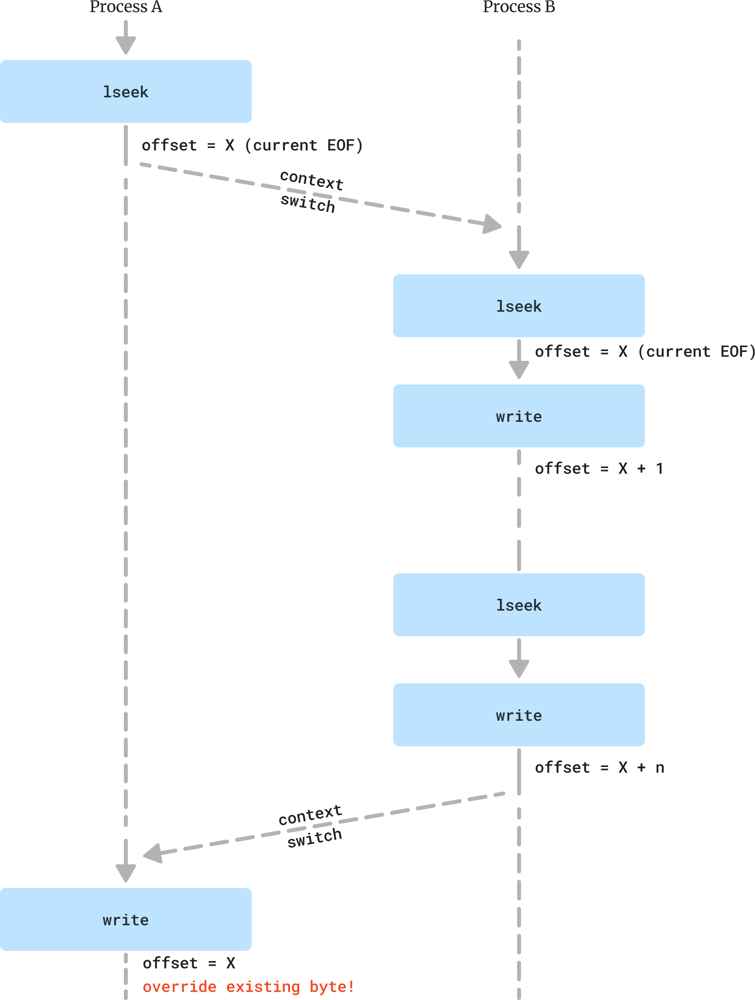

### atomic_append.c
```C
#define _LARGEFILE64_SOURCE
#define _FILE_OFFSET_BITS 64
#include <sys/stat.h>
#include <fcntl.h>
#include "tlpi_hdr.h"

int
main(int argc, char *argv[])
{
    int fd;

    if (argc <= 2 || strcmp(argv[1], "--help") == 0)
        usageErr("%s num_bytes pathname\n", argv[0]);

    char *filename = argv[1];
    long num_bytes = atoll(argv[2]);
    bool x_param = argc >= 4 && !strcmp(argv[3], "x");
    int maybe_o_append_flag = x_param ? 0 : O_APPEND;


    fd = open(filename, O_RDWR | O_CREAT | maybe_o_append_flag, S_IRUSR | S_IWUSR);
    if (fd == -1)
        errExit("open");

    for (long l = 0; l < num_bytes; l++) {
        if (x_param) {
            if (lseek(fd, 0, SEEK_END) == -1)
                errExit("lseek");
        }
        if (write(fd, "x", 1) == -1) errExit("write");
    }

    if (close(fd) == -1) errExit("close");

    exit(EXIT_SUCCESS);
}

```

### Testing
```bash
> ./atomic_append f1 1000000 & ./atomic_append f1 1000000
[1] 10492
[1]  + 10492 done       ./atomic_append f1 1000000
> ls -l f1
-rw------- 1 debian debian 2000000 Jun 29 15:33 f1
>
> ./atomic_append f2 1000000 x & ./atomic_append f2 1000000 x
[1] 17060
[1]  + 17060 done       ./atomic_append f2 1000000 x
> ls -l f2
-rw------- 1 debian debian 1047551 Jun 29 16:06 f2
```

The first run produced exactly 2000000 bytes. Means every single byte was written by the 2 parallel executions of `/atomic_append f1 1000000`.


The second run produced only 1047551 bytes. This is because of a race between the 2 parallel executions of `/atomic_append f2 1000000 x`.

Such a race condition can happen if the kernel scheduler switch from one process run of atomic_append to the second process right after the `lseek` call.<br/>
Then both processes are at the same offset within file `f2`. The second will write as many bytes as the time-slice it has allows.<br/>
Then when the first process gets the CPU back, it will continue from where it left off, with the same offset in the file that already has a byte written to it.

