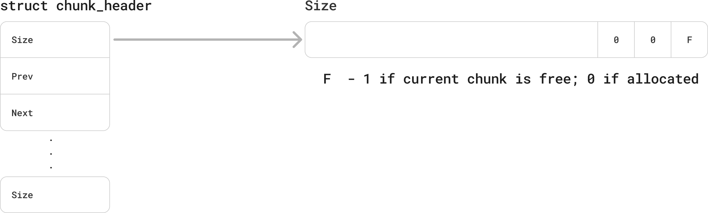
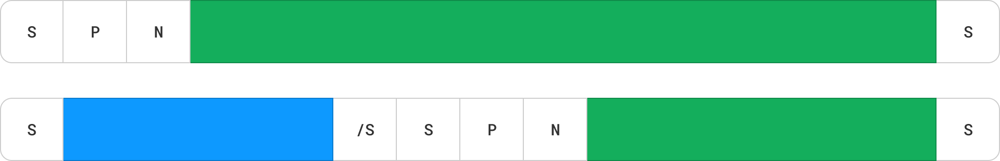
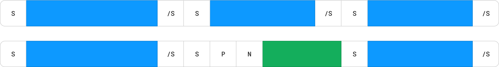
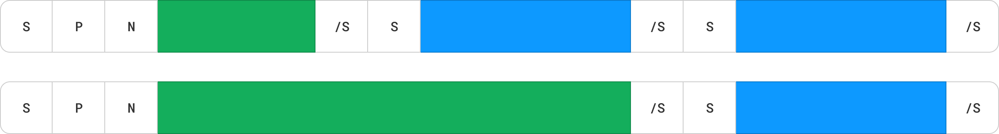
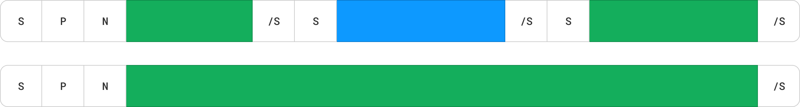

## Allocator design
* The implemented strategy is First-fit
* Chunks are aligned to 8 bytes
    - If for example the program will ask 50 bytes, the allocated chunk will actuall have 54 bytes
* Each chunk will have a size header of size_t that will appear before and after the chunk payload
    - Means the total space a chunk takes including the size headers has extra of `sizeof(size_t) * 2` bytes
* A chunk will be marked as free by setting the LSB of the preceding size header to 1
    - This is possible since the 3 LSBs of the size aren't used as the chunk size is always a multiply of 8
* Free chunks forms a linked list in order to iterate only free chunks during allocation
    - Within the free chunk payload there will be pointers for the next and previous chunks
    - Having these pointers in the payload dictates a minimal chunk size of 2 pointers
    - We'll also coalesce adjacent chunks when freeing


### Free chunk structure


### Behavior


#### Allocate

New chunk is allocated with preceding and ending size header

In case a free chunk with sufficient space is found, we'll split it and use part of it for allocation


#### Free
Freeing a chunk will coalesce adjacent chunks if possible

Free between used chunks


Free before a freed chunk


Free after freed chunks


Free a chunk between two freed chunks



### Missing functionallity
* Preallocating extra memory in order to reduce sbrk syscalls
* Multi threading - our allocator isn't thread safe
* Better error handling
* sbrk shrinking - This allocator doesn't give memory back to the OS
* Multiple free list pools according to size for faster allocation

And probably a lot more...


## mymalloc.c

```C
#include <stdio.h>
#include <stdlib.h>
#include <unistd.h>
#include <string.h>
#include <assert.h>

#define SIZE_HEADER_SIZE sizeof(size_t)
#define CHUNK_OVERHEAD (SIZE_HEADER_SIZE + SIZE_HEADER_SIZE) // size header and footer
#define ALIGN_8(x) ((((x-1) >> 3) << 3) + 8)
#define FREE_FLAG 1

typedef struct chunk_header {
    size_t size;
    struct chunk_header* prev; // relevant only for free chunks
    struct chunk_header* next; // relevant only for free chunks
} chunk_header;

#define MIN_FREE_CHUNK_SIZE (sizeof(chunk_header) + sizeof(size_t)) // chunk_header + footer size header

chunk_header* free_list_head = NULL;

void* heap_base = NULL; 

#define CHUNK_SIZE(c) ((c)->size & ~(FREE_FLAG))
#define IS_FREE(c) ((c)->size & FREE_FLAG)
#define SET_FREE(c) ((c)->size |= FREE_FLAG)
#define SET_ALLOCATED(c) ((c)->size &= ~FREE_FLAG)

// #define CHUNK_FOOTER(c) (*(size_t*)(((char*) (c)) + SIZE_HEADER_SIZE + CHUNK_SIZE(c)))

void *mymalloc(size_t size);
void myfree(void *ptr);

static void
set_chunk_size_headers(chunk_header *chunk, size_t size)
{
    chunk->size = size;
    
    // set footer size header
    size_t *footer = (size_t*) (((char*) chunk) + size + SIZE_HEADER_SIZE);
    *footer = size;
}

static chunk_header *
find_free_chunk(size_t size)
{
    chunk_header* current = free_list_head;
    while (current) {
        if (CHUNK_SIZE(current) >= size) {
            return current;
        }
        current = current->next;
    }
    return NULL;
}

static chunk_header *
expand_heap(size_t size)
{
    // init
    if (heap_base == NULL) {
        heap_base = sbrk(0);  // initialize heap_base to the current break address
    }

    // align requested size to a multiply of 8
    size_t total_size = size + CHUNK_OVERHEAD;
    chunk_header* chunk = (chunk_header*) sbrk(total_size);
    if (chunk == (void*) -1) {
        return NULL; // sbrk failed
    }
    set_chunk_size_headers(chunk, size);
    return chunk;
}

static void
remove_from_free_list(chunk_header *chunk)
{
    if (chunk->prev) {
        chunk->prev->next = chunk->next;
    } else {
        free_list_head = chunk->next;
    }
    if (chunk->next) {
        chunk->next->prev = chunk->prev;
    }
}

static void
add_to_free_list(chunk_header *chunk)
{
    chunk->next = free_list_head;
    if (free_list_head) {
        free_list_head->prev = chunk;
    }
    free_list_head = chunk;
    chunk->prev = NULL;
}

static void
split_chunk(chunk_header *chunk, size_t size)
{
    size_t chunk_size_with_headers = size + CHUNK_OVERHEAD;
    if (CHUNK_SIZE(chunk) >= chunk_size_with_headers + MIN_FREE_CHUNK_SIZE) {
        // there's enough space for both the new chunk including headers and at least a minimal free chunk
        
        size_t remaining_size = CHUNK_SIZE(chunk) - chunk_size_with_headers;

        chunk_header *new_chunk = (chunk_header*)(((char*) chunk) + chunk_size_with_headers);
        set_chunk_size_headers(new_chunk, remaining_size);
        SET_FREE(new_chunk);
        add_to_free_list(new_chunk);
        
        set_chunk_size_headers(chunk, size);
    }
}

static chunk_header *
get_prev_chunk(chunk_header *chunk)
{
    chunk_header* prev_chunk_footer = (chunk_header*) (((char*) chunk) - sizeof(size_t));
    if (((void*) prev_chunk_footer) < heap_base) {
        return NULL;
    }

    size_t prev_chunk_size = CHUNK_SIZE(prev_chunk_footer);
    return (chunk_header*) (((char*) chunk) - prev_chunk_size - CHUNK_OVERHEAD);

}

static void
coalesce(chunk_header *chunk)
{
    chunk_header* next_chunk = (chunk_header*)(((char*) chunk) + CHUNK_SIZE(chunk) + CHUNK_OVERHEAD);
    if (IS_FREE(next_chunk)) {
        remove_from_free_list(next_chunk);
        set_chunk_size_headers(chunk, CHUNK_SIZE(chunk)
         + CHUNK_OVERHEAD // absorbed chunk header now becomes part of the space of the coalesced chunk
         + CHUNK_SIZE(next_chunk));
    }
    
    chunk_header* prev_chunk = get_prev_chunk(chunk);
    if (prev_chunk && IS_FREE(prev_chunk)) {
        remove_from_free_list(chunk);
        set_chunk_size_headers(prev_chunk, CHUNK_SIZE(prev_chunk)
         + CHUNK_OVERHEAD // absorbed chunk header now becomes part of the space of the coalesced chunk
         + CHUNK_SIZE(chunk));

        // update the current chunk to the previous chunk after merging
        chunk = prev_chunk;
    }
}

void *
mymalloc(size_t size)
{
    size_t aligned_size = ALIGN_8(size);

    chunk_header* chunk = find_free_chunk(aligned_size);
    if (chunk) {
        remove_from_free_list(chunk);
        split_chunk(chunk, aligned_size);
        SET_ALLOCATED(chunk);
        return ((char*) chunk) + SIZE_HEADER_SIZE; // return pointer to payload
    }

    // no big enough chunk found, extend the heap
    chunk = expand_heap(aligned_size);
    if (!chunk) {
        return NULL; // OOM!
    }

    SET_ALLOCATED(chunk);
    return (void*) (((char*) chunk) + SIZE_HEADER_SIZE); // return pointer to payload
}

void
myfree(void *ptr)
{
    if (!ptr) {
        return;
    }

    chunk_header* chunk = (chunk_header*)(((char*) ptr) - SIZE_HEADER_SIZE);
    SET_FREE(chunk);
    add_to_free_list(chunk);
    coalesce(chunk);
}

// used for testing
static size_t 
get_chunk_size(void *chunk_payload)
{
    return CHUNK_SIZE((chunk_header*) (((char*) chunk_payload) - SIZE_HEADER_SIZE));
}

int
main()
{
    void *ptr1 = mymalloc(100);

    // chunk aligned to multiplies of 8s
    assert(get_chunk_size(ptr1) == 104);

    void *ptr2 = mymalloc(200);
    void *ptr3 = mymalloc(50);


    // free block gets reallocated
    myfree(ptr1);
    void *ptr4 = mymalloc(100);
    assert(ptr4 == ptr1);


    // coalesce freed block with adjacent blocks
    size_t ptr1_with_overhead_size = get_chunk_size(ptr1) + CHUNK_OVERHEAD;
    size_t ptr3_with_overhead_size = get_chunk_size(ptr3) + CHUNK_OVERHEAD;
    size_t ptr2_size = get_chunk_size(ptr2);
    myfree(ptr1); // free lower block
    myfree(ptr3); // free upper block

    myfree(ptr2);
    size_t ptr1_size = get_chunk_size(ptr1);
    assert(ptr1_size == ( // we now have one big free block including all allocated space so far
        ptr1_with_overhead_size + ptr3_with_overhead_size + ptr2_size));

    // split free block
    char *allocated_chunk = (char*) mymalloc(24);
    size_t expected_remaining_space = ptr1_size - 24 - CHUNK_OVERHEAD;
    size_t actual_size = CHUNK_SIZE(free_list_head);

    assert(actual_size == expected_remaining_space);


    char *test_str = "This is it.";
    strcpy(allocated_chunk, test_str);
    printf("%s\n", allocated_chunk);
    myfree(allocated_chunk);

    return 0;
}

```