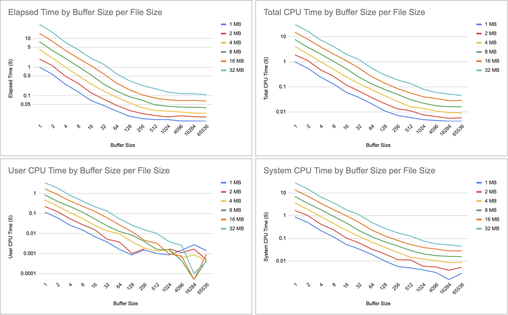
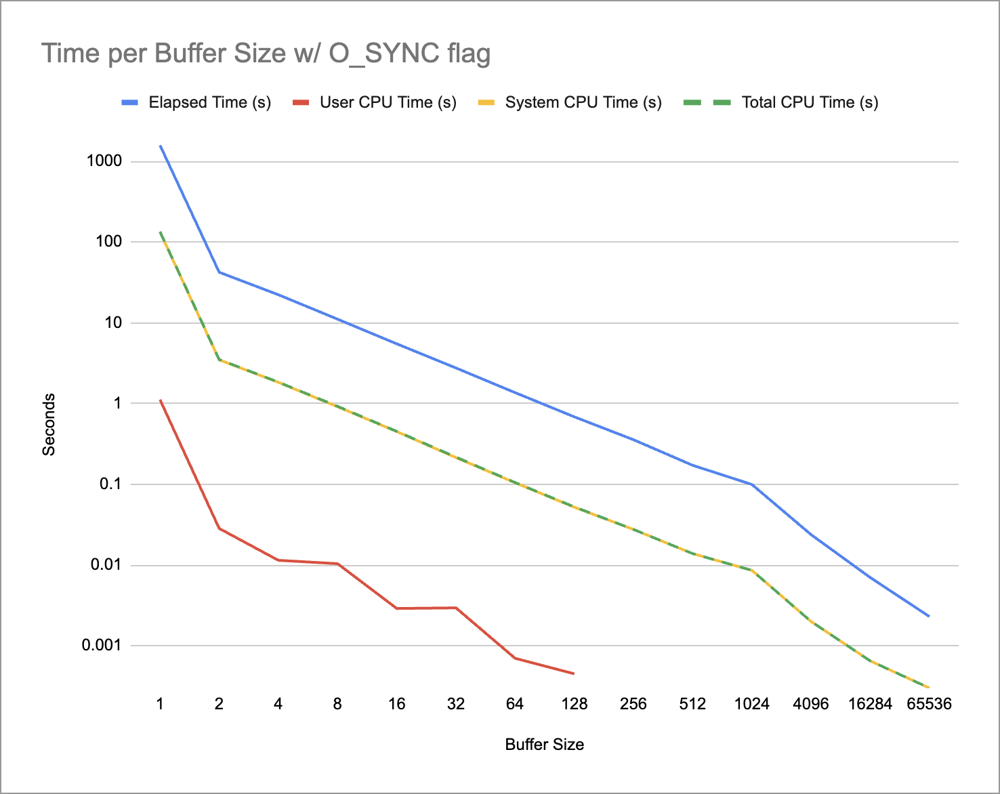
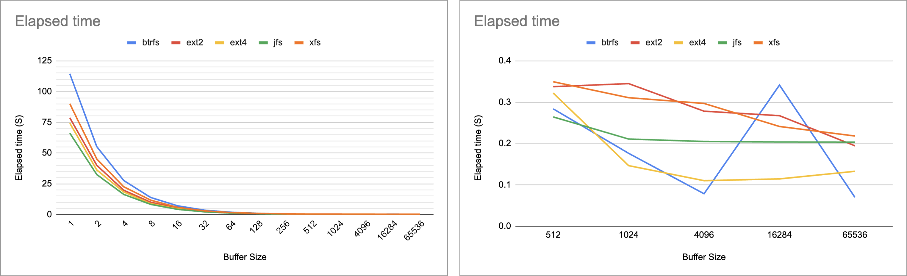
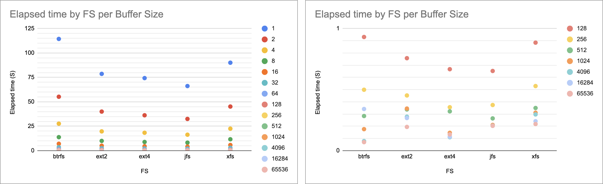
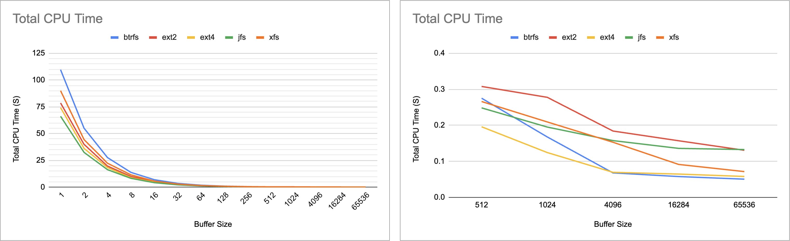
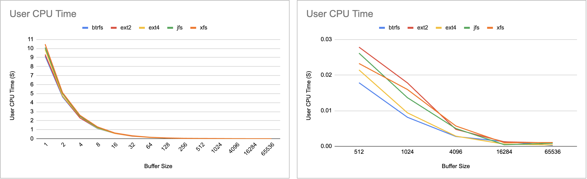
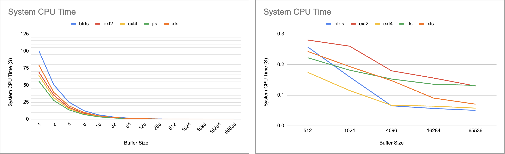

I used Chat GPT for automating the testing procedure:
- File generation of different sizes
- Run compilation with different buffer size parameters
- Run and measure the copy program with the `time` util
- Unmount and Mount the disk in order to bypass cache for cleaner measurements

See the [Test code](#test-code) section below

Also see the [time_results](./time_results/) folder for the various time measurements.


All tests ran on a M1 machine running Debian Linux using QEMU 7.2 Arm Virtual Machine

# A
As expected, a bigger buffer has a better performance.



**(Log Scale)**

Something weird to notice is that User Time is near zero for a buffer size of 16284 when copying files of 8MB and above.

# B
What a way to kill performance!

I didn't compute the average of 20 runs this time, life is too short for that.

Copying just 1MB file with a one byte buffer took 1582 seconds.

Also with O_SYNC flag specified, the bigger the buffer - the better the performance.





# C

The following tests show time metrics for copying a 100MB file on ext2, ext4, bfs, btrfs, and jfs file systems.


## Elapsed Time
For small buffer size, jfs wins the race with "only" 66 Seconds to copy a 100MB file with a buffer of one byte.

On the other hand, btrfs performance is almost as twice as bad for small buffer sizes - 114 Seconds with a one byte buffer.

As we increase the buffer size, performance gets better.

It seem that ext4 performance peaks at 4096 bytes buffer and gets slightly slower for bigger buffers.

With a buffer of 16284 bytes btrfs takes more time than with a 4096 buffer, which is not something I'd expect.
Bigger Elapsed that's not reflected by CPU time (See below), suggests we have more activity with the hardware. Perhaps btrfs creates more disk writes for this amount of bytes.




## CPU Time
The btrfs quirk at 16284 buffer isn't reflected in the CPU time measurements:



### User CPU Time
User CPU time is negligble with buffer sizes bigger than 4096

For a one byte buffer size, the results ranges between xfs spending 10.47 seconds in user space to btrfs with 9.14 seconds.

All in all, it seem that the user side (libc) has the least effect on performace.



### System CPU Time
The time spent in the Kernel has the most effect on performance.

As with the Elapsed Time graph, jfs having the best performance for small buffers and btrfs is strugling in the same area.

As we increase the buffer size, performance improves for all FS.

Ext4 and btrfs performs better than the others with a buffer of 4096 and above.



## Test code


### gen_rand_file.sh
This script generate random content by a size specified in MB.

```bash
#!/bin/bash

# Function to generate a file with random content
generate_random_file() {
    local file_name=$1
    local size_in_mb=$2

    # Validate inputs
    if [[ -z "$file_name" || -z "$size_in_mb" || ! "$size_in_mb" =~ ^[0-9]+$ ]]; then
        echo "Usage: $0 <file_name> <size_in_mb>"
        exit 1
    fi

    # Convert MB to bytes (1 MB = 1048576 bytes)
    local size_in_bytes=$((size_in_mb * 1048576))

    # Use dd to create a file with random content
    dd if=/dev/urandom of="$file_name" bs=1M count="$size_in_mb" status=progress

    echo "File '$file_name' with size ${size_in_mb}MB generated."
}

# Script execution
generate_random_file "$1" "$2"

```

#### Usage

```shell
> bash gen_rand_file.sh source 100  
100+0 records in
100+0 records out
104857600 bytes (105 MB, 100 MiB) copied, 0.310063 s, 338 MB/s
File 'source' with size 100MB generated.
```

### measure_copy.sh
This script compiles copy.c for the following buffer sizes -
1, 2, 4, 8, 16, 32, 64, 128, 256, 512, 1024, 4096, 16284, 65536

For each buffer size, it will compute the the average out of 20 runs.
In order to bust the cache, the script unmounts and mounts the drive provided to the folder provided as parameters.

```bash
#!/bin/bash

# Ensure correct number of arguments
if [ "$#" -ne 4 ]; then
    echo "Usage: $0 <source_file> <output_file> <device_path> <mount_folder>"
    exit 1
fi

# Input parameters
SOURCE_FILE=$1
OUTPUT_FILE_PARAM=$2
DEVICE_PATH=$3
MOUNT_FOLDER=$4

# Define the buffer sizes to test
BUF_SIZES=(1 2 4 8 16 32 64 128 256 512 1024 4096 16284 65536)

# Output file for the results
RESULTS_FILE="${SOURCE_FILE}_results.csv"

# Check if the source file exists
if [ ! -f "$SOURCE_FILE" ]; then
    echo "Error: Source file '${SOURCE_FILE}' does not exist."
    exit 1
fi

# Initialize the results file with a header
echo "Buffer Size,Elapsed Time (s),Total CPU Time (s),User CPU Time (s),System CPU Time (s)" > $RESULTS_FILE

# Loop over each buffer size
for BUF_SIZE in "${BUF_SIZES[@]}"; do
    echo "Measuring for BUF_SIZE=${BUF_SIZE}..."

    # Compile the program with the current BUF_SIZE
    cc -std=c99 -D_XOPEN_SOURCE=600 -D_DEFAULT_SOURCE -DBUF_SIZE=${BUF_SIZE} \
       -g -I../lib -pedantic -Wall -W -Wmissing-prototypes -Wno-sign-compare \
       -Wimplicit-fallthrough -Wno-unused-parameter copy.c ../libtlpi.a -o copy

    # Check if compilation was successful
    if [ $? -ne 0 ]; then
        echo "Compilation failed for BUF_SIZE=${BUF_SIZE}. Skipping..."
        continue
    fi

    # Initialize accumulators
    total_elapsed=0
    total_cpu=0
    total_user=0
    total_system=0

    # Run the program 20 times and collect statistics
    for i in {1..20}; do
        echo "  Running iteration $i/20 for BUF_SIZE=${BUF_SIZE}..."

        # Unmount and remount the drive to bypass OS cache
        echo "    Unmounting ${DEVICE_PATH} from ${MOUNT_FOLDER}..."
        sudo umount "$MOUNT_FOLDER"
        if [ $? -ne 0 ]; then
            echo "Error: Failed to unmount ${MOUNT_FOLDER}."
            exit 1
        fi

        echo "    Remounting ${DEVICE_PATH} to ${MOUNT_FOLDER}..."
        sudo mount "$DEVICE_PATH" "$MOUNT_FOLDER"
        if [ $? -ne 0 ]; then
            echo "Error: Failed to remount ${DEVICE_PATH}."
            exit 1
        fi

        # Measure time with the time command
        TIME_OUTPUT=$( (time ./copy "$SOURCE_FILE" "$OUTPUT_FILE_PARAM") 2>&1)
        
        # Parse the time output
        elapsed=$(echo "$TIME_OUTPUT" | grep real | awk '{print $2}' | sed 's/m/:/g' | awk -F: '{print ($1 * 60) + $2}')
        user=$(echo "$TIME_OUTPUT" | grep user | awk '{print $2}' | sed 's/m/:/g' | awk -F: '{print ($1 * 60) + $2}')
        system=$(echo "$TIME_OUTPUT" | grep sys | awk '{print $2}' | sed 's/m/:/g' | awk -F: '{print ($1 * 60) + $2}')

        # Calculate total CPU time (user + system)
        cpu=$(echo "$user + $system" | bc)

        # Print the results of the current iteration
        echo "    Iteration $i results: Elapsed=${elapsed}s, Total CPU=${cpu}s, User CPU=${user}s, System CPU=${system}s"

        # Accumulate the times
        total_elapsed=$(echo "$total_elapsed + $elapsed" | bc)
        total_cpu=$(echo "$total_cpu + $cpu" | bc)
        total_user=$(echo "$total_user + $user" | bc)
        total_system=$(echo "$total_system + $system" | bc)
    done

    # Compute averages
    avg_elapsed=$(echo "$total_elapsed / 20" | bc -l)
    avg_cpu=$(echo "$total_cpu / 20" | bc -l)
    avg_user=$(echo "$total_user / 20" | bc -l)
    avg_system=$(echo "$total_system / 20" | bc -l)

    # Append results to the output file
    echo "$BUF_SIZE,$avg_elapsed,$avg_cpu,$avg_user,$avg_system" >> $RESULTS_FILE
done

echo "Results saved to $RESULTS_FILE."

```

### Example run
For ext2:
```bash
> 
>
Measuring for BUF_SIZE=1...
  Running iteration 1/20 for BUF_SIZE=1...
    Unmounting /dev/sda from /mnt/ext2-drive...
    Remounting /dev/sda to /mnt/ext2-drive...
    Iteration 1 results: Elapsed=76.508s, Total CPU=76.463s, User CPU=9.11s, System CPU=67.353s
  Running iteration 2/20 for BUF_SIZE=1...
    Unmounting /dev/sda from /mnt/ext2-drive...
    Remounting /dev/sda to /mnt/ext2-drive...
    Iteration 2 results: Elapsed=77.518s, Total CPU=77.468s, User CPU=9.124s, System CPU=68.344s
  Running iteration 3/20 for BUF_SIZE=1...
    Unmounting /dev/sda from /mnt/ext2-drive...
    Remounting /dev/sda to /mnt/ext2-drive...

... Output truncated ...

  Running iteration 18/20 for BUF_SIZE=65536...
    Unmounting /dev/sda from /mnt/ext2-drive...
    Remounting /dev/sda to /mnt/ext2-drive...
    Iteration 18 results: Elapsed=0.202s, Total CPU=.166s, User CPU=0s, System CPU=0.166s
  Running iteration 19/20 for BUF_SIZE=65536...
    Unmounting /dev/sda from /mnt/ext2-drive...
    Remounting /dev/sda to /mnt/ext2-drive...
    Iteration 19 results: Elapsed=0.328s, Total CPU=.197s, User CPU=0.005s, System CPU=0.192s
  Running iteration 20/20 for BUF_SIZE=65536...
    Unmounting /dev/sda from /mnt/ext2-drive...
    Remounting /dev/sda to /mnt/ext2-drive...
    Iteration 20 results: Elapsed=0.179s, Total CPU=.111s, User CPU=0s, System CPU=0.111s
Results saved to /mnt/ext2-drive/source_results.csv.

```
