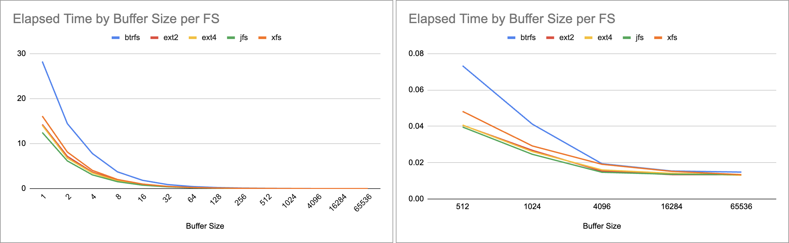
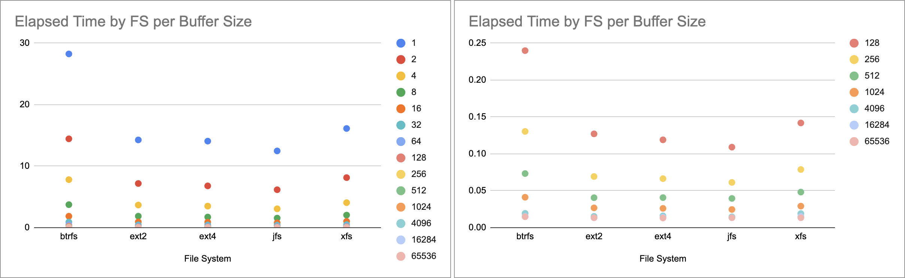
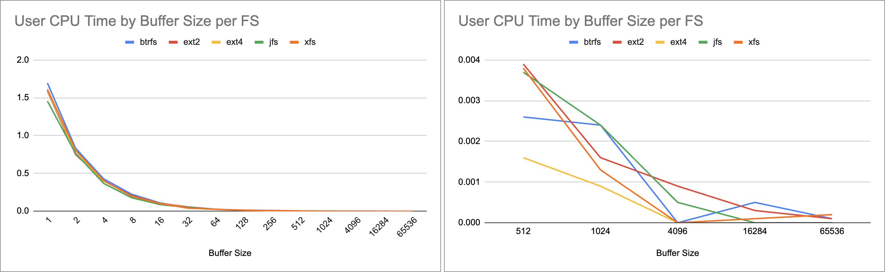
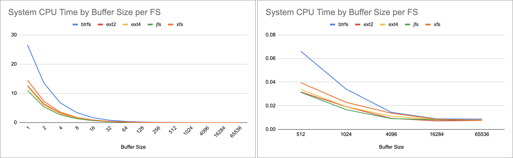

All tests made with a 32MB file on a M1 machine running Debian Linux using QEMU 7.2 Arm Virtual Machine

## Elpased Time

For small buffer write, jfs is the fastest, while btrfs is the slowest.

ext4 wins for buffers of 4096 bytes. for bigger buffers jfs and ext4 wins but without much difference from other file systems.
```
+-------------+---------+---------+---------+---------+--------+
| Buffer Size |  btrfs  |  ext2   |  ext4   |   jfs   |  xfs   |
+-------------+---------+---------+---------+---------+--------+
|           1 | 28.2498 | 14.2641 | 14.0698 | 12.4767 | 16.125 |
|           2 | 14.4466 |  7.1796 |  6.7901 |   6.169 | 8.1356 |
|           4 |  7.8082 |  3.6775 |  3.5028 |  3.0658 | 4.0654 |
|           8 |  3.7415 |  1.8657 |  1.7252 |  1.5532 | 2.0421 |
|          16 |  1.8585 |  0.9361 |  0.8882 |  0.7844 | 1.0256 |
|          32 |   0.915 |  0.4652 |  0.4412 |  0.4099 | 0.5064 |
|          64 |  0.4697 |  0.2398 |  0.2264 |  0.2085 | 0.2615 |
|         128 |  0.2399 |  0.1271 |   0.119 |  0.1091 | 0.1419 |
|         256 |  0.1304 |  0.0693 |  0.0664 |  0.0613 | 0.0788 |
|         512 |  0.0733 |  0.0406 |  0.0407 |  0.0396 | 0.0482 |
|        1024 |  0.0412 |  0.0268 |  0.0261 |  0.0246 | 0.0292 |
|        4096 |  0.0194 |  0.0153 |   0.016 |  0.0147 | 0.0191 |
|       16284 |  0.0154 |  0.0134 |  0.0141 |  0.0136 | 0.0152 |
|       65536 |  0.0148 |  0.0134 |  0.0131 |  0.0134 | 0.0134 |
+-------------+---------+---------+---------+---------+--------+
```




## User CPU Time
```
+-------------+--------+--------+--------+--------+--------+
| Buffer Size | btrfs  |  ext2  |  ext4  |  jfs   |  xfs   |
+-------------+--------+--------+--------+--------+--------+
|           1 | 1.6949 |   1.59 | 1.6035 | 1.4563 | 1.6128 |
|           2 | 0.8344 | 0.7509 |  0.768 | 0.7639 | 0.8061 |
|           4 | 0.4278 | 0.3993 | 0.4016 | 0.3685 | 0.4066 |
|           8 | 0.2241 | 0.2071 | 0.1983 | 0.1777 | 0.1986 |
|          16 | 0.1102 | 0.1053 | 0.1029 | 0.0883 |  0.102 |
|          32 | 0.0487 | 0.0558 | 0.0456 | 0.0487 | 0.0407 |
|          64 | 0.0249 | 0.0255 | 0.0268 | 0.0258 | 0.0254 |
|         128 | 0.0132 | 0.0139 | 0.0107 | 0.0108 | 0.0121 |
|         256 | 0.0068 | 0.0092 | 0.0043 | 0.0074 | 0.0079 |
|         512 | 0.0026 | 0.0039 | 0.0016 | 0.0037 | 0.0038 |
|        1024 | 0.0024 | 0.0016 | 0.0009 | 0.0024 | 0.0013 |
|        4096 |      0 | 0.0009 |      0 | 0.0005 |      0 |
|       16284 | 0.0005 | 0.0003 |      0 |      0 | 0.0001 |
|       65536 | 0.0001 | 0.0001 |      0 |      0 | 0.0002 |
+-------------+--------+--------+--------+--------+--------+
```



## System CPU Time

```
+-------------+---------+---------+---------+--------+---------+
| Buffer Size |  btrfs  |  ext2   |  ext4   |  jfs   |   xfs   |
+-------------+---------+---------+---------+--------+---------+
|           1 | 26.5264 | 12.6601 | 12.3801 | 11.014 | 14.5031 |
|           2 | 13.5946 |  6.4214 |  6.0164 | 5.4002 |  7.3231 |
|           4 |  6.8318 |  3.2719 |  3.0962 | 2.6922 |  3.6533 |
|           8 |  3.5108 |  1.6546 |  1.5219 | 1.3708 |  1.8385 |
|          16 |    1.74 |  0.8259 |  0.7805 | 0.6914 |  0.9188 |
|          32 |  0.8606 |  0.4047 |  0.3907 | 0.3565 |  0.4615 |
|          64 |  0.4403 |  0.2099 |  0.1945 | 0.1784 |  0.2316 |
|         128 |  0.2221 |   0.109 |  0.1031 | 0.0939 |  0.1252 |
|         256 |  0.1175 |  0.0553 |  0.0567 | 0.0495 |  0.0663 |
|         512 |  0.0661 |  0.0317 |  0.0338 | 0.0314 |  0.0395 |
|        1024 |  0.0341 |  0.0192 |  0.0193 | 0.0167 |  0.0229 |
|        4096 |  0.0144 |  0.0093 |  0.0111 | 0.0091 |  0.0137 |
|       16284 |  0.0089 |  0.0072 |  0.0084 | 0.0082 |  0.0086 |
|       65536 |  0.0087 |  0.0076 |  0.0079 | 0.0076 |  0.0076 |
+-------------+---------+---------+---------+--------+---------+
```



## Test code
I used Chat GPT for automating the testing procedure

```bash
#!/bin/bash

# Ensure the output file argument is provided
if [ $# -ne 1 ]; then
    echo "Usage: $0 <output_file>"
    exit 1
fi

output_file=$1  # First argument to the script is the output file name
csv_file="results.csv"

# Configuration
buffer_sizes=(1 2 4 8 16 32 64 128 256 512 1024 4096 16284 65536)
iterations=20
total_tests=$(( ${#buffer_sizes[@]} * iterations ))
current_test=0
file_size_bytes=$((32 * 1024 * 1024))

# Write CSV header
echo "buffer_size,elapsed_time,total_cpu_time,user_cpu_time,system_cpu_time" > $csv_file

# Function to compute averages
compute_averages() {
    local times=("$@")
    local total=0
    for time in "${times[@]}"; do
        total=$(echo "$total + $time" | bc -l)
    done
    echo "scale=4; $total / ${#times[@]}" | bc -l
}

# Main loop
for buffer_size in "${buffer_sizes[@]}"; do
        
    elapsed_times=()
    user_cpu_times=()
    system_cpu_times=()

    for ((i = 1; i <= iterations; i++)); do
        # Increment the test count
        current_test=$((current_test + 1))
        progress=$((current_test * 100 / total_tests))

        # Print progress
        echo -ne "Running: Buffer Size=$buffer_size, Iteration=$i/$iterations, Progress=$progress% \r"

        # Run the write_bytes program and capture timing details

        TIME_OUTPUT=$( (time ./write_bytes "$output_file" "$file_size_bytes" "$buffer_size") 2>&1)
        
        # Parse the time output
        elapsed=$(echo "$TIME_OUTPUT" | grep real | awk '{print $2}' | sed 's/m/:/g' | awk -F: '{print ($1 * 60) + $2}')
        user_cpu=$(echo "$TIME_OUTPUT" | grep user | awk '{print $2}' | sed 's/m/:/g' | awk -F: '{print ($1 * 60) + $2}')
        system_cpu=$(echo "$TIME_OUTPUT" | grep sys | awk '{print $2}' | sed 's/m/:/g' | awk -F: '{print ($1 * 60) + $2}')

        # Calculate total CPU time (user + system)
        cpu=$(echo "$user_cpu + $system_cpu" | bc)

        # Print the results of the current iteration
        echo "    [buff=$buffer_size] Iteration $i results: Elapsed=${elapsed}s, Total CPU=${cpu}s, User CPU=${user_cpu}s, System CPU=${system_cpu}s"

        elapsed_times+=("$elapsed")
        user_cpu_times+=("$user_cpu")
        system_cpu_times+=("$system_cpu")
    done

    # Compute averages
    avg_elapsed=$(compute_averages "${elapsed_times[@]}")
    avg_user_cpu=$(compute_averages "${user_cpu_times[@]}")
    avg_system_cpu=$(compute_averages "${system_cpu_times[@]}")
    avg_total_cpu=$(echo "$avg_user_cpu + $avg_system_cpu" | bc -l)

    # Append to CSV
    echo "$buffer_size,$avg_elapsed,$avg_total_cpu,$avg_user_cpu,$avg_system_cpu" >> $csv_file
done

# Final message
echo -e "\nResults written to $csv_file"
```