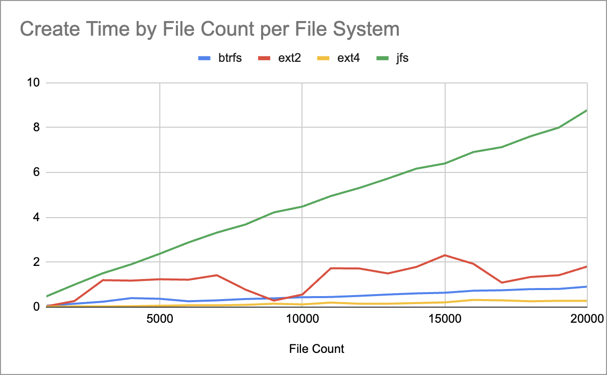
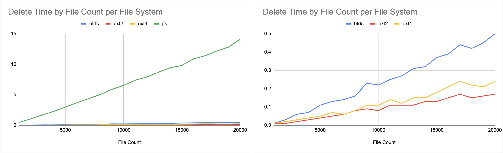
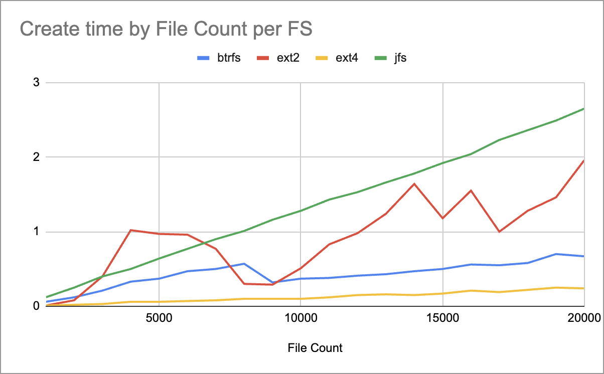
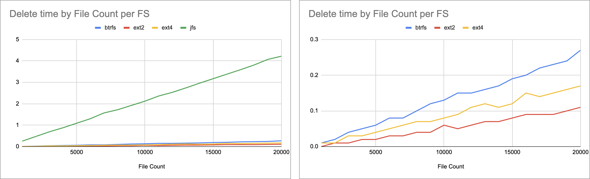
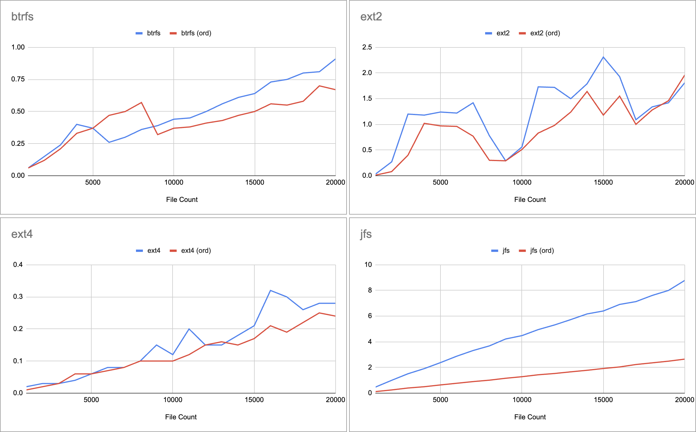
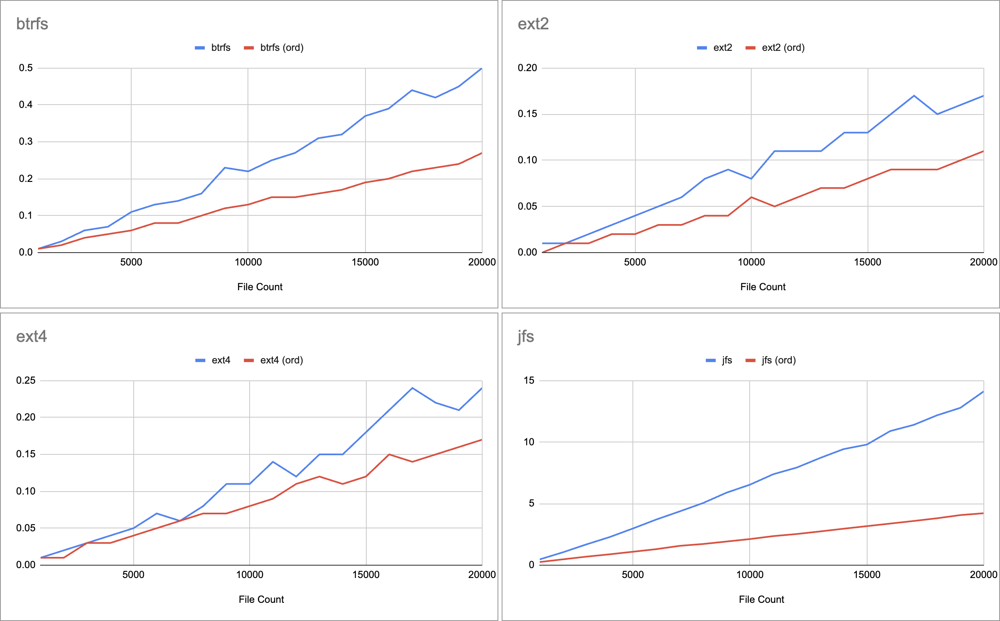

# Experiment 1 - Create files in random order & Delete by order

In the first experiment, the program creates files with names of the form xNNNNNN, where NNNNNN is replaced by a random six-digit number.
The files created in the random order in which their names are generated, and then deleted in increasing numerical order.

I tested for btrfs, ext2, ext3, and jfs file systems for various number of files from 1000 - 20000.

The results are an average of 10 runs per FS and number of files.

## Creation Time by File Count per File System
ext4 turns out to be the undisputed champion for file creation.

jfs lags far behind

ext2 behavior is inconsistent

### Speculations for why ext4 was faster than the others
ext4 is highly optimized for concurrent operations, meaning it can create many small files in parallel more efficiently than older (ext2) or more complex (btrfs) file systems.

ext4 uses a fast journaling mechanism optimized for small files. also, ext4 incorporates delayed allocation and extents to speed up file creation.

btrfs uses Copy-on-Write (CoW) for all writes, including metadata. When a file is created, it first writes the changes to a new location, then updates pointers to reference the new data. While CoW ensures data integrity and simplifies snapshotting, it adds extra I/O and metadata processing overhead.
ext4 does not use CoW for normal writes, which means fewer steps are involved in creating files.

btrfs uses B-trees for managing metadata, which are highly scalable and efficient for large datasets. However, for operations like small file creation, the extra complexity of maintaining B-trees (e.g., rebalancing during inserts) adds latency.
ext4 uses extents to handle metadata. For small files, extents are simpler and faster to allocate and update compared to B-trees.


jfs (Journaled File System) was developed by IBM for large systems and is optimized for workloads involving large files rather than small file operations. File creation involves more overhead due to its emphasis on data integrity and large-scale performance.

JFS has a sophisticated metadata management system designed for scalability and reliability, which adds latency during file creation compared to EXT4 or BTRFS.

As an older file system, JFS prioritizes features like crash recovery and scalability over raw performance for small, frequent operations like file creation.

#### Summary
These differences explain why EXT4 and BTRFS are faster for file creation, while EXT2 lags slightly due to its older design, and JFS is slower due to its focus on other priorities.



```
+------------+-------+------+------+------+
| File Count | btrfs | ext2 | ext4 | jfs  |
+------------+-------+------+------+------+
|       1000 |  0.06 | 0.03 | 0.02 | 0.47 |
|       2000 |  0.15 | 0.27 | 0.03 |    1 |
|       3000 |  0.24 |  1.2 | 0.03 | 1.51 |
|       4000 |   0.4 | 1.18 | 0.04 | 1.91 |
|       5000 |  0.37 | 1.24 | 0.06 | 2.38 |
|       6000 |  0.26 | 1.22 | 0.08 | 2.88 |
|       7000 |   0.3 | 1.42 | 0.08 | 3.32 |
|       8000 |  0.36 | 0.78 |  0.1 | 3.68 |
|       9000 |  0.39 | 0.29 | 0.15 | 4.22 |
|      10000 |  0.44 | 0.56 | 0.12 | 4.48 |
|      11000 |  0.45 | 1.73 |  0.2 | 4.95 |
|      12000 |   0.5 | 1.72 | 0.15 | 5.31 |
|      13000 |  0.56 |  1.5 | 0.15 | 5.73 |
|      14000 |  0.61 | 1.79 | 0.18 | 6.17 |
|      15000 |  0.64 | 2.31 | 0.21 |  6.4 |
|      16000 |  0.73 | 1.93 | 0.32 | 6.91 |
|      17000 |  0.75 | 1.09 |  0.3 | 7.13 |
|      18000 |   0.8 | 1.34 | 0.26 | 7.61 |
|      19000 |  0.81 | 1.42 | 0.28 |    8 |
|      20000 |  0.91 | 1.81 | 0.28 | 8.78 |
+------------+-------+------+------+------+
```


## Deletion Time by File Count per File System


```
+------------+-------+------+------+-------+
| File Count | btrfs | ext2 | ext4 |  jfs  |
+------------+-------+------+------+-------+
|       1000 |  0.01 | 0.01 | 0.01 |  0.46 |
|       2000 |  0.03 | 0.01 | 0.02 |  1.04 |
|       3000 |  0.06 | 0.02 | 0.03 |  1.68 |
|       4000 |  0.07 | 0.03 | 0.04 |  2.28 |
|       5000 |  0.11 | 0.04 | 0.05 |  2.98 |
|       6000 |  0.13 | 0.05 | 0.07 |  3.71 |
|       7000 |  0.14 | 0.06 | 0.06 |  4.37 |
|       8000 |  0.16 | 0.08 | 0.08 |  5.05 |
|       9000 |  0.23 | 0.09 | 0.11 |  5.89 |
|      10000 |  0.22 | 0.08 | 0.11 |  6.54 |
|      11000 |  0.25 | 0.11 | 0.14 |  7.39 |
|      12000 |  0.27 | 0.11 | 0.12 |  7.93 |
|      13000 |  0.31 | 0.11 | 0.15 |  8.71 |
|      14000 |  0.32 | 0.13 | 0.15 |  9.43 |
|      15000 |  0.37 | 0.13 | 0.18 |   9.8 |
|      16000 |  0.39 | 0.15 | 0.21 |  10.9 |
|      17000 |  0.44 | 0.17 | 0.24 |  11.4 |
|      18000 |  0.42 | 0.15 | 0.22 | 12.18 |
|      19000 |  0.45 | 0.16 | 0.21 | 12.79 |
|      20000 |   0.5 | 0.17 | 0.24 | 14.13 |
+------------+-------+------+------+-------+
```

### Why ext2 is Likely the fastest for deletion
No Journaling Overhead - ext2 does not use journaling, so it avoids the overhead of logging and committing metadata updates for deletion operations. This makes file deletions significantly faster since there’s no need to ensure crash consistency.
Simpler Metadata Management:

ext2 metadata structures (e.g., block bitmaps and inode tables) are simpler and less feature-rich than ext4, btrfs, or jfs. File deletion only involves marking blocks and inodes as free, which is fast and straightforward in ext2.

### Why ext4, btrfs, or jfs would be slower
* ext4 - ext4’s journaling system requires recording metadata changes (e.g., freeing blocks and inodes) in the journal, introducing some overhead during deletions. While efficient, it cannot compete with the simplicity of ext2 in this specific case.
* btrfs - btrfs uses Copy-on-Write (CoW) and complex metadata structures like B-trees. Deleting files in btrfs involves:
    - Updating B-tree nodes to reflect freed space.
    - Maintaining CoW consistency.
    - Potentially handling additional features like checksumming and snapshots, which slow down deletions.
  This makes btrfs generally slower at deletion compared to ext4 and ext2.
* jfs - jfs is designed for reliability and large-scale workloads, not speed. Its more complex metadata and journaling mechanisms make file deletion slower compared to ext2 or ext4.

## fs_benchmark.c
```C
#include <time.h>
#include <fcntl.h>
#include <limits.h>

#include "tlpi_hdr.h"

#define MAX_RECORDS 1000000 // maximum of 6-digit numbers (0 to 999999)

int
main(int argc, char *argv[])
{
    if (argc != 3) {
        usageErr("Usage: %s <number_of_files> <directory>\n", argv[0]);
    }

    int number_of_files = atoi(argv[1]);
    const char *directory = argv[2];

    if (number_of_files <= 0 || number_of_files > MAX_RECORDS) {
        errExit("Number of files must be between 1 and %d.\n", MAX_RECORDS);
    }

    int *used_numbers = calloc(MAX_RECORDS, sizeof(int));
    if (!used_numbers) {
        errExit("calloc");
    }

    int *generated_numbers = malloc(number_of_files * sizeof(int));
    if (!generated_numbers) {
        errExit("malloc");
    }

    int *sorted_numbers = malloc(number_of_files * sizeof(int));
    if (!sorted_numbers) {
        errExit("malloc");
    }

    srand(time(NULL)); // seed random

    int generated_cnt = 0;
    while (generated_cnt < number_of_files) {
        int random_number = rand() % MAX_RECORDS; // generate a random number between 0 and 999999
        if (!used_numbers[random_number]) { // ensure unique numbers
            used_numbers[random_number] = 1;
            generated_numbers[generated_cnt++] = random_number;
        }
    }

    int sorted_idx = 0;
    for (int i = 0; i < MAX_RECORDS; i++) {
        if (used_numbers[i] > 0) {
            sorted_numbers[sorted_idx] = i;
            sorted_idx++;
        }
    }

    free(used_numbers); // no longer needed

    char file_path[_POSIX_PATH_MAX];
    struct timespec start, end;

    clock_gettime(CLOCK_MONOTONIC, &start); // measure creation - start

    // create files
    for (int i = 0; i < number_of_files; i++) {
        snprintf(file_path, _POSIX_PATH_MAX, "%s/x%06d", directory, generated_numbers[i]);

        int fd = open(file_path, O_CREAT | O_WRONLY, S_IRUSR | S_IWUSR);
        if (fd == -1) {
            errExit("open");
        }

        if (write(fd, "x", 1) == -1) { // write 1 byte
            errExit("write");
        }
        close(fd);
    }
    
    free(generated_numbers);

    clock_gettime(CLOCK_MONOTONIC, &end);  // measure creation - end
    double creation_time = (end.tv_sec - start.tv_sec) + (end.tv_nsec - start.tv_nsec) / 1e9;
    printf("Create: %.2f seconds\n", creation_time);

    clock_gettime(CLOCK_MONOTONIC, &start); // measure deletion - start

    // delete files in sorted order
    for (int i = 0; i < number_of_files; i++) {
        snprintf(file_path, _POSIX_PATH_MAX, "%s/x%06d", directory, sorted_numbers[i]);
        if (unlink(file_path) == -1) {
            errExit("unlink");
        }
    }

    clock_gettime(CLOCK_MONOTONIC, &end); // measure creation - end
    double deletion_time = (end.tv_sec - start.tv_sec) + (end.tv_nsec - start.tv_nsec) / 1e9;
    printf("Delete: %.2f seconds\n", deletion_time);

    free(sorted_numbers);

    return 0;
}

```

# Experiment 2 - Create files in order & Delete by order
In the second experiemnet, we'd like to check if the results change if the files are created in increasing numerical order (x000001, x000001, x0000002, and so on) and then deleted in the same order.


Comparing file-systems shows the same leaderboard. ext4 is the fastest to create files, and ext2 is the fastest to delete files.



However, both creation and deletion operations are faster for all file systems when files are created in order.

### Random vs. Ordered creation - File creation time


### Random vs. Ordered creation - File deletion time


## Speculations for why Ordered creation and deletion of files is faster
* Better metadata locality - Files created in order are more likely to have their metadata stored contiguously, which reduces lookup overhead.
* Efficient directory management - Inserting and deleting files sequentially aligns with the internal organization of most file systems.
* Reduced disk I/O - Contiguous metadata and aligned access patterns minimize random disk seeks, especially on HDDs.

### File system specifics

#### ext2
* No journaling - ext2 lacks a journal, which means metadata changes are written directly to disk. Random file creation causes scattered metadata placement in the directory structure.
* Linear directory storage - Directory entries are stored as a simple list. Random insertion requires scanning the list to find a place for new entries, which is inefficient compared to ordered insertions that can append directly.
* Deletion - Deleting files in numerical order aligns with the way the metadata is stored if files were created sequentially. Random order creation leads to more seeks during deletion.

#### ext4
* ext4 journals metadata changes, which adds overhead but ensures consistency. Random file creation introduces more writes to the journal because of fragmented directory updates.
* ext4 uses an HTree (hashed B-tree) for large directories, improving lookup performance compared to ext2. However, ordered creation aligns metadata better within the HTree.
Random creation causes more rebalancing and node splitting in the HTree, slowing down insertion.

#### btrfs
* btrfs uses B-trees for metadata, making it more resilient to random operations. However:
    - Ordered creation minimizes the number of B-tree node splits and insertions, making it faster.
    - Random creation causes scattered metadata placement in the tree structure.
* btrfs implements CoW for all changes, including metadata. Random creation and deletion involve more CoW operations, which are slower than sequential writes.
* btrfs allocates chunks for metadata and data. Ordered operations allow metadata to be written more contiguously within a chunk, improving performance.

## Summary
```
+-------------+------------------------------------------------------------------------+
| File System |                Why Ordered Creation/Deletion Was Faster                |
+-------------+------------------------------------------------------------------------+
| ext2        | Avoids directory fragmentation, fewer seeks for linear storage.        |
| ext4        | Reduced HTree rebalancing, contiguous extent allocation.               |
| btrfs       | Fewer B-tree rebalancing and optimized CoW behavior.                   |
| jfs         | Aligns with B+ tree indexing and reduces metadata allocation overhead. |
+-------------+------------------------------------------------------------------------+
```

## fs_benchmark_ord.c
```C
#include <time.h>
#include <fcntl.h>
#include <limits.h>

#include "tlpi_hdr.h"

#define MAX_RECORDS 1000000 // maximum of 6-digit numbers (0 to 999999)

int
main(int argc, char *argv[])
{
    if (argc != 3) {
        usageErr("Usage: %s <number_of_files> <directory>\n", argv[0]);
    }

    int number_of_files = atoi(argv[1]);
    const char *directory = argv[2];

    if (number_of_files <= 0 || number_of_files > MAX_RECORDS) {
        errExit("Number of files must be between 1 and %d.\n", MAX_RECORDS);
    }

    char file_path[_POSIX_PATH_MAX];
    struct timespec start, end;

    clock_gettime(CLOCK_MONOTONIC, &start); // measure creation - start

    // create files
    for (int i = 0; i < number_of_files; i++) {
        snprintf(file_path, _POSIX_PATH_MAX, "%s/x%06d", directory, i);

        int fd = open(file_path, O_CREAT | O_WRONLY, S_IRUSR | S_IWUSR);
        if (fd == -1) {
            errExit("open");
        }

        if (write(fd, "x", 1) == -1) { // write 1 byte
            errExit("write");
        }
        close(fd);
    }

    clock_gettime(CLOCK_MONOTONIC, &end);  // measure creation - end
    double creation_time = (end.tv_sec - start.tv_sec) + (end.tv_nsec - start.tv_nsec) / 1e9;
    printf("Create: %.2f seconds\n", creation_time);

    clock_gettime(CLOCK_MONOTONIC, &start); // measure deletion - start

    // delete files
    for (int i = 0; i < number_of_files; i++) {
        snprintf(file_path, _POSIX_PATH_MAX, "%s/x%06d", directory, i);
        if (unlink(file_path) == -1) {
            errExit("unlink");
        }
    }

    clock_gettime(CLOCK_MONOTONIC, &end); // measure creation - end
    double deletion_time = (end.tv_sec - start.tv_sec) + (end.tv_nsec - start.tv_nsec) / 1e9;
    printf("Delete: %.2f seconds\n", deletion_time);

    return 0;
}

```

# benchmark.sh
```bash
#!/bin/bash

# Check for correct usage
if [ "$#" -ne 2 ]; then
    echo "Usage: $0 <benchmark_command> <target_folder>"
    echo "Example: $0 'sudo ./fs_benchmark' /mnt/jfs-drive"
    exit 1
fi

# Read the parameters
BENCHMARK_COMMAND=$1
TARGET_FOLDER=$2

# Output CSV file for results
OUTPUT_FILE="results.csv"

# Write the CSV header
echo "File Count,Avg Create Time (s),Avg Delete Time (s)" > $OUTPUT_FILE

# Total number of iterations (file counts)
total_iterations=$(seq 1000 1000 20000 | wc -l)
current_iteration=0

# Iterate through file counts from 1000 to 20000 with a step of 1000
for file_count in $(seq 1000 1000 20000); do
    # Update the current iteration count
    current_iteration=$((current_iteration + 1))
    
    total_create_time=0
    total_delete_time=0

    # Run the benchmark 10 times
    for i in {1..10}; do
        # Display dynamic status at the bottom
        printf "\rProcessing $file_count files... ($current_iteration/$total_iterations), Run $i/10"
        result=$($BENCHMARK_COMMAND "$file_count" "$TARGET_FOLDER")

        # Extract the create and delete times
        create_time=$(echo "$result" | grep "Create:" | awk '{print $2}')
        delete_time=$(echo "$result" | grep "Delete:" | awk '{print $2}')
        
        # Accumulate the times
        total_create_time=$(echo "$total_create_time + $create_time" | bc)
        total_delete_time=$(echo "$total_delete_time + $delete_time" | bc)
    done

    # Calculate the averages
    avg_create_time=$(echo "scale=2; $total_create_time / 10" | bc)
    avg_delete_time=$(echo "scale=2; $total_delete_time / 10" | bc)

    # Write the results to the CSV file
    echo "$file_count,$avg_create_time,$avg_delete_time" >> $OUTPUT_FILE

    # Notify completion of this file count
    printf "\rCompleted benchmark for $file_count files. ($current_iteration/$total_iterations)\n"
done

echo "All benchmarks completed. Results saved to $OUTPUT_FILE."

```
