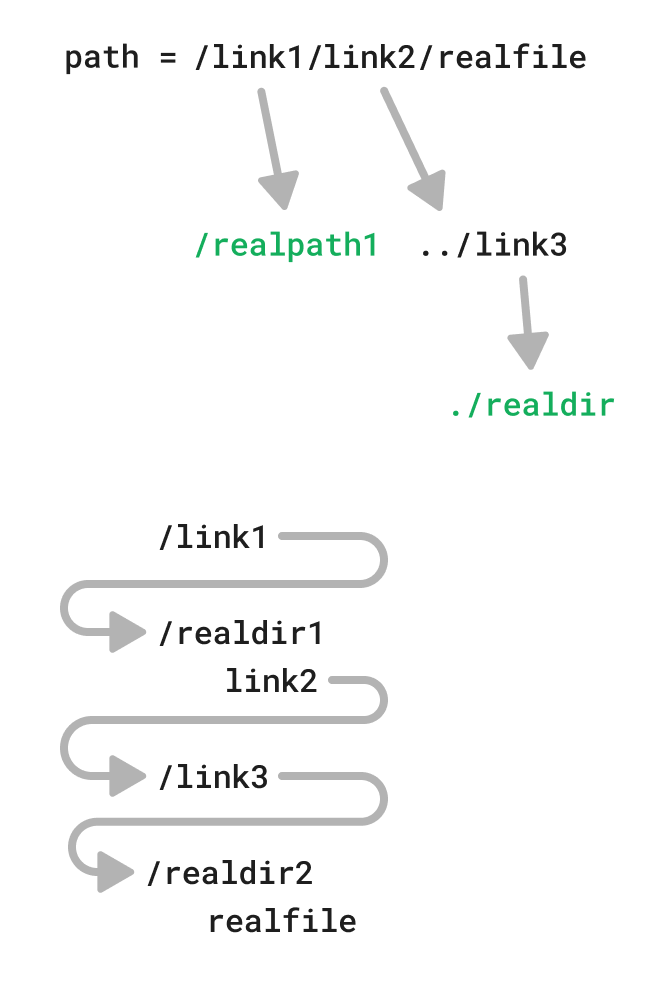

## Design

Every part of the path can be a symlink. And that symlink can reffer another symlink and so on...


### Example case
We'll use an example to think of the algorithm.

Consider the path `/link1/link2/realfile` where:
* link1 is a symlink pointing an absolute path - /realpath1
* link2 is a symlink to a relative path to abother symlink - link3
* link3 is a symlink with a relative path to another directory - ./realdir



While iterating through the path parts, we'll need to replace everything we iterated so far with the path referenced by the symlink.

We will need to distinguish between the case of symlink referening an absolute path to a one that has a relative path:
* For an absolute path - we will need to replace the path we iterated so far
* For a relative path - we will need to combine the path we iterated so far with the path within the symlink 

It looks like we should take a recursive approach.


** We also need to consider circular symlink referencing and limit the number of dereferencing in order to avoid infinite loop.

### Pseudocode

```c
char *
myrealpath(const char *path, char *resolved_path)
{
    char base[PATH_MAX]; // we'll build our path gradully on top of that base
    char absolute_path[PATH_MAX];
    char normalized_path[PATH_MAX];

    absolute_path = to_absolute_path(path)
    normalized_path = normalize_path(path); // remove "." and ".."
    char **path_parts = split(normalized_path, "/");
    char path_part[PATH_MAX];

    path_part = next(path_parts);

    while (path_part) {
        with_part = base + "/" + path_part;
        
        if (is_symlink(with_part)) {
            symlink_path = readlink(with_part);
            
            if (is_absolute_symlink) {
                base = symlink_path; // switch base
            } else {
                base = base + symlink_path // update base
            }

            char base_real_path[PATH_MAX];
            myrealpath(base, base_real_path); // recursive call
            
            if (base_real_path == NULL)
                return NULL; // broken link
            
            base = copy(base_real_path); // switch base
        } else {
            base = base + "/" + path_part; // update base
        }

        path_part = next(path_parts);
    }

    if (!validate_path(base)) {
        return NULL;
    }
    
    if (resolved_path == NULL) {
        resolved_path = malloc(PATH_MAX);
    }

    resolved_path = copy(base);
    return resolved_path;
}

```


## myrealpath.c

```C
#define _GNU_SOURCE

#include <limits.h>
#include <sys/stat.h>

#include "tlpi_hdr.h"


#define SYMLINK_MAX 10


char *myrealpath(const char *path, char *resolved_path);

/**
 * remove . and .. from absolute path
 */
static void
normalize_path(char *path)
{
    char *curr_pos;
    curr_pos = path;

    char *saveptr;
    char *path_part = strtok_r(path, "/", &saveptr);
    if (path_part == NULL) {
        strcpy(path, "/\0");
        return;
    }

    int part_len = strlen(path_part);
    
    while (path_part) {
        if (strcmp(path_part, ".") == 0) {
            // skip "./"
        } else if (strcmp(path_part, "..") == 0) {
            // move one folder up
            char *last_slash = strrchr(path, '/');
            if (last_slash) {
                *last_slash = '\0'; // remove last slash
                curr_pos = last_slash;
            }
        } else {
            *curr_pos = '/';
            curr_pos++;
            strcpy(curr_pos, path_part);
            curr_pos += part_len;
            *curr_pos = '\0';
        }
        
        path_part = strtok_r(NULL, "/", &saveptr); // next path part
        part_len = path_part ? strlen(path_part) : 0;
    }

    if (path[0] == '\0') {
        strcpy(path, "/\0");
    }
}

static void
set_resolved_path(char **resolved_path, char *path)
{
    if (*resolved_path == NULL) {
        // allocate resolved_path if NULL
        if ((*resolved_path = malloc(PATH_MAX)) == NULL)
            errExit("malloc");
    }

    strncpy(*resolved_path, path, PATH_MAX - strlen(*resolved_path) - 1);
}

static void
to_absolute_path(char *path)
{
    if (path[0] == '/') { // absolute path given
        // do nothing
    } else {
        // get current working directory and concat with given (relative) path
        char current_path[PATH_MAX];

        if (getcwd(current_path, sizeof(current_path)) == NULL)
            errExit("getcwd");

        // dynamically allocate denormalized_path
        strncat(current_path, "/", PATH_MAX - 1);
        strncat(current_path, path, PATH_MAX - strlen(path));

        strncpy(path, current_path, PATH_MAX - 1);
    }
}

static char *
resolve_realpath(const char *path, char *resolved_path, int symlink_depth)
{
    if (!path || symlink_depth > SYMLINK_MAX) {
        errno = EINVAL;
        return NULL;
    }

    char base[PATH_MAX]; // we'll build our path gradully on top of that base
    strcpy(base, "\0");
    
    char path_buff[PATH_MAX];
    strcpy(path_buff, path);
    
    normalize_path(path_buff); // remove ".." and "."

    if (strcmp(path_buff, "/") == 0) {
        set_resolved_path(&resolved_path, "/");
        return resolved_path;
    }
    
    char *saveptr;
    char *path_part = strtok_r(path_buff, "/", &saveptr); // split by "/"

    struct stat sb;
    
    while (path_part) {
        char with_path_buff[PATH_MAX];
        
        // append path part to base
        strncpy(with_path_buff, base, PATH_MAX - 1);
        strncat(with_path_buff, "/", PATH_MAX - 1);
        strncat(with_path_buff, path_part, PATH_MAX - strlen(base) - 1);
        
        if (lstat(with_path_buff, &sb) == 0 && S_ISLNK(sb.st_mode)) { // symlink
            char symlink_buff[PATH_MAX];
            ssize_t link_path_len = readlink(with_path_buff, symlink_buff, PATH_MAX - 1);
            if (link_path_len == -1) {
                return NULL;
            }
            symlink_buff[link_path_len] = '\0';

            if (symlink_buff[0] == '/') { // symlink references an absolute path
                strncpy(base, symlink_buff, PATH_MAX - 1); // switch base
                base[PATH_MAX - 1] = '\0';
            } else { // relative path
                // append symlink to base
                strncat(base, "/", PATH_MAX - 1);
                strncat(base, symlink_buff, PATH_MAX - 1);
            }

            char real_base_path[PATH_MAX];
            char *resolved_real_base_path = resolve_realpath(base, real_base_path, ++symlink_depth);

            if (resolved_real_base_path == NULL)
                return NULL;
            
            strncpy(base, real_base_path, PATH_MAX - 1); // switch base
        } else { // real path
            strncpy(base, with_path_buff, PATH_MAX - 1); // update base
        }

        path_part = strtok_r(NULL, "/", &saveptr); // next path part
    }

    if (path[strlen(path) - 1] == '/') { // original path param expects a directory
        strncat(base, "/", PATH_MAX - strlen(base) - 1); // update resolved path with a "/"
    }

    // validate the final resolved path
    if (stat(base, &sb) != 0) {
        return NULL;
    }
    
    set_resolved_path(&resolved_path, base);
    return resolved_path;
}


char *
myrealpath(const char *path, char *resolved_path)
{
    char path_buff[PATH_MAX];
    strncpy(path_buff, path, PATH_MAX - 1);
    to_absolute_path(path_buff);
    return resolve_realpath(path_buff, resolved_path, 0);
}


int main(int argc, char **argv) {
    if (argc != 2) {
        fprintf(stderr, "Usage: %s <path>\n", argv[0]);
        return EXIT_FAILURE;
    }

    char *resolved_path = myrealpath(argv[1], NULL);
    if (resolved_path) {
        printf("%s\n", resolved_path);
        free(resolved_path);
    } else {
        fprintf(stderr, "Failed to resolve path: %s\n", strerror(errno));
    }

    return EXIT_SUCCESS;
}

```

## Testing

I'll use the `readlink` command in order to verify myself


### Relative symlink dereference
```
> readlink /bin
usr/bin
> ./myrealpath /bin
/usr/bin
```

### Double symlink
```
> readlink /bin/ps2txt 
ps2ascii
> ./myrealpath /bin/ps2txt
/usr/bin/ps2ascii
```

### Symlink to directory is expected
```
> ./myrealpath /bin/      
/usr/bin/
```

### Symlink to a airectory is expected but directory doesn't exist
```
> ./myrealpath /bin/ps2txt/
Failed to resolve path: Not a directory
```

### Relative path
```
> pwd
/mnt/macos/tlpi-solutions/chapter_18
> ./myrealpath .././//../
/mnt/macos/
```

### Complex
```
> mkdir realdir1
> mkdir realdir2
> touch realdir2/realfile
> ln -s /mnt/macos/tlpi-solutions/chapter_18/realdir1 ./link1   # create symlink with an absolute path
> cd realdir1
> ln -s ../link3 ./link2        # create symlink with a relative path
> ls -l 
total 4
lrwxrwxrwx 1 debian debian 8 Jan  5 21:46 link2 -> ../link3
> cd ..
> ln -s ./realdir2 /link3
> ls -l | grep link
lrwxrwxrwx 1 debian debian     45 Jan  5 21:43 link1 -> /mnt/macos/tlpi-solutions/chapter_18/realdir1
lrwxrwxrwx 1 debian debian     10 Jan  5 21:46 link3 -> ./realdir2
>
> ./myrealpath ./link1/link2/realfile
/mnt/macos/tlpi-solutions/chapter_18/realdir2/realfile
```
