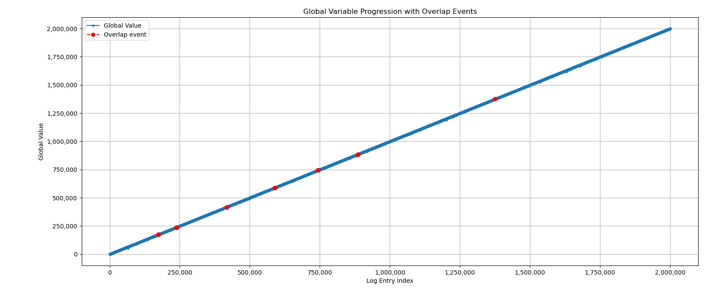
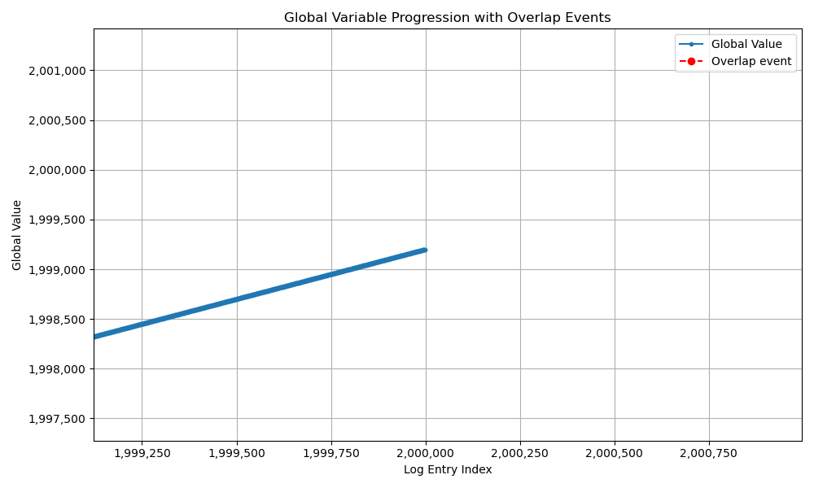
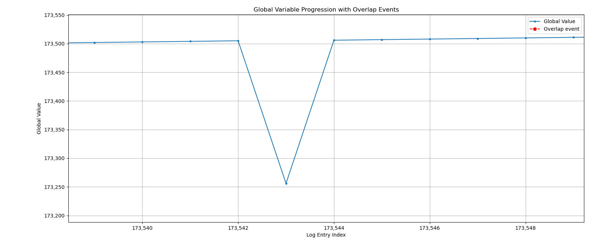
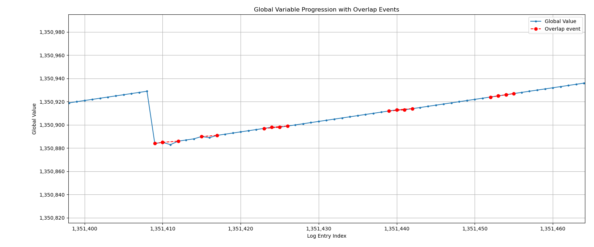

I [modified](#thread_incr_modc) thread_incr.c (See [thread_incr_mod.c](./thread_incr_mod.c)) to print the thread id (1 or 2) and the glob variable.

There are two types of anomalies I've detected while observing the output file. See [Analysis](#analysis) below.

## thread_incr_mod.c
```diff
diff -u ./thread_incr.c thread_incr_mod.c  
--- ./thread_incr.c	2025-02-22 02:36:55.555100263 +0200
+++ thread_incr_mod.c	2025-02-22 20:29:37.274079367 +0200
@@ -21,15 +21,23 @@
 #include <pthread.h>
 #include "tlpi_hdr.h"
 
+struct thread_args {
+    int id;
+    int loops;
+};
+
 static volatile int glob = 0;   /* "volatile" prevents compiler optimizations
                                    of arithmetic operations on 'glob' */
 static void *                   /* Loop 'arg' times incrementing 'glob' */
 threadFunc(void *arg)
 {
-    int loops = *((int *) arg);
+    struct thread_args targs = *((struct thread_args *) arg);
+    int id = targs.id;
+    int loops = targs.loops;
     int loc, j;
 
     for (j = 0; j < loops; j++) {
+        printf("[%d] glob = %d\n", id, glob);
         loc = glob;
         loc++;
         glob = loc;
@@ -43,13 +51,18 @@
 {
     pthread_t t1, t2;
     int loops, s;
+    struct thread_args t1_args, t2_args;
 
     loops = (argc > 1) ? getInt(argv[1], GN_GT_0, "num-loops") : 10000000;
+    t1_args.id = 1;
+    t2_args.id = 2;
+    t1_args.loops = loops;
+    t2_args.loops = loops;
 
-    s = pthread_create(&t1, NULL, threadFunc, &loops);
+    s = pthread_create(&t1, NULL, threadFunc, &t1_args);
     if (s != 0)
         errExitEN(s, "pthread_create");
-    s = pthread_create(&t2, NULL, threadFunc, &loops);
+    s = pthread_create(&t2, NULL, threadFunc, &t2_args);
     if (s != 0)
         errExitEN(s, "pthread_create");
 
```

## Analysis
I ran `thread_incr_mod` with the arg `1000000`.

This produced a file with 2000001 lines, the total prints of the two thread (1M + 1M) and the last print from the main thread.
```
> ./thread_incr_mod 1000000 > output.txt
> cat output.txt | wc -l           
2000001
> tail -5 output.txt
[2] glob = 1999510
[2] glob = 1999511
[2] glob = 1999512
[2] glob = 1999513
glob = 1999514
```

I observed 2 kind of phenomenas while checking the output file:

### Lost updates
This is the most common case.<br/>
There's a context switch, an old value of glob is printed, but then in the next iteration, the right value is printed.

```
1354: [1] glob = 1353
1355: [1] glob = 1354
1356: [1] glob = 1355
1357: [2] glob = 0
1358: [2] glob = 1357
1359: [2] glob = 1358
```

In this specific example:
1. In line 1356, thread 1 printed `[1] glob = 1354`
2. There was a context switch to thread 2.
3. In line 1357, thread 2 printed `[2] glob = 0`
4. In the next iteration (line 1358), thread 2 printed 1357.

This anomaly probably happen due to context switching between the time the glob value is loaded, to the time it is actually being printed.

By observing the assembly code of our program, we can see there are multiple instructions for just calling `printf`:
```
    1930:	f00000e0 	adrp	x0, 20000 <_exit@GLIBC_2.17>
    1934:	91139000 	add	x0, x0, #0x4e4
    1938:	b9400000 	ldr	w0, [x0]
    193c:	2a0003e2 	mov	w2, w0
    1940:	b9403be1 	ldr	w1, [sp, #56]
    1944:	b0000000 	adrp	x0, 2000 <usageErr+0x10>
    1948:	91136000 	add	x0, x0, #0x4d8
    194c:	97ffff7d 	bl	1740 <printf@plt>
```
The actual loading of glob happens at `b9400000 	ldr	w0, [x0]`, and the call to `printf` happen few instructions after.<br/>
But `printf` glibc implementation itself includes thousands of more instructions. The context switch can happen anywhere in between.


### Overlapping updates
In this case, we context switch between threads, but the glob value go back to a previous value and increased from there in the next iterations.

For example, by scanning the file for values that repeats, I found 173513 printed twice:
```
> awk '/glob = 173513$/ {print NR":", $0}' output.txt
173552: [2] glob = 173513
173581: [1] glob = 173513
```

The first update of thread 2 looks legit. numbers are increasing linearly:
```
> awk 'NR>=173550 && NR<=173554 {print NR":", $0}' output.txt
173550: [2] glob = 173511
173551: [2] glob = 173512
173552: [2] glob = 173513
173553: [2] glob = 173514
173554: [2] glob = 173515
```

The later case (the overlap), sets our global value to a previous value:
```
> awk 'NR>=173579 && NR<=173583 {print NR":", $0}' output.txt
173579: [2] glob = 173540
173580: [2] glob = 173541
173581: [1] glob = 173513
173582: [2] glob = 173514
173583: [1] glob = 173515
```

And from there the value is increasing. causing further overlaps.

This anomally happens probably due to context switch that happen in between the loading of glob to storing back the increased result.


Looking at the assembly code, we can see the instructions for loading, increasing and storing the `glob` variable:
```
        loc = glob;
    1904:	f00000e0 	adrp	x0, 20000 <_exit@GLIBC_2.17>
    1908:	91139000 	add	x0, x0, #0x4e4
    190c:	b9400000 	ldr	w0, [x0]
    1910:	b90033e0 	str	w0, [sp, #48]
        loc++;
    1914:	b94033e0 	ldr	w0, [sp, #48]
    1918:	11000400 	add	w0, w0, #0x1
    191c:	b90033e0 	str	w0, [sp, #48]
        glob = loc;
    1920:	f00000e0 	adrp	x0, 20000 <_exit@GLIBC_2.17>
    1924:	91139000 	add	x0, x0, #0x4e4
    1928:	b94033e1 	ldr	w1, [sp, #48]
    192c:	b9000001 	str	w1, [x0]
```

There are only 7 instructions between the actual load of `glob` (`ldr	w0, [x0]`) to the storing of the increased value (`ldr	w0, [x0]`)


### ChatGPT for deeper analysis
I asked ChatGPT to write an analysis program that detects the increasing number anomalies ([thread_incr_analyze.py](./thread_incr_analyze.py))

It produced the following output:
```
> python3 thread_incr_analyze.py output.txt 
=== Analysis Summary ===
Total updates (lines): 2000000
Context switches: 13333
Lost update events (non-sequential increments): 5187
Updates per thread:
  Thread 1: 1000000 updates
  Thread 2: 1000000 updates
Overlap events (stale read followed by an increment from that stale value): 123
Details of overlap events:
  Thread 1 at line 173596 read stale value 173529 and then at line 173598 incremented to 173530.
  Thread 1 at line 173600 read stale value 173532 and then at line 173601 incremented to 173533.
  Thread 1 at line 173601 read stale value 173533 and then at line 173602 incremented to 173534.
  ... OUTPUT TRUNCATED ...
  Thread 2 at line 885023 read stale value 884521 and then at line 885024 incremented to 884522.
  Thread 2 at line 1375163 read stale value 1374521 and then at line 1375165 incremented to 1374522.
```

This confirms that the overlap events is rare (123 occurrences) compared to the lost update events (5187 occurrences).

It make sense if we consider the scope of instructions involved with each anomaly.<br/>
There are more chances a context switch will happen within the instructions mentions in [lost updates](#lost-updates) then with the instructions involved with [Overlapping updates](#overlapping-updates).


Then there's a nice visualization the pops out:



Though it looks like this graph gets to 2M, it's not. The graph is dense and we have to zoom in:



The red dots in the overview shows overlapping numbers.

If we zoom into the graph at certain place we can see examples of the the anomalies we mentioned above:

Lost update - The wrong number is printed, but then our increasing number gets back "on track".


Overlapping updates - Context switch happened after loading glob, but before storing the increased value of it.
Context switching back restors the previous value loaded. 


