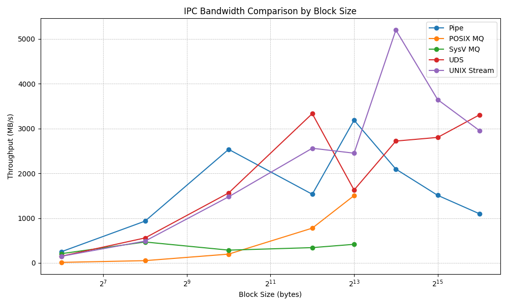

# Implementation

For brevity, the code is not included directly in this document. The source code for each IPC bandwidth test program is available below:
- [pipe_bandwidth.c](pipe_bandwidth.c) (Previous excersize)
- [posix_msgq_bandwidth.c](posix_msgq_bandwidth.c)
- [sysv_msgq_bandwidth.c](sysv_msgq_bandwidth.c)
- [uds_bandwidth.c](uds_bandwidth.c)
- [unix_stream_bandwidth.c](unix_stream_bandwidth.c)

# IPC Bandwidth Comparison

| Block Size | Pipe | POSIX MQ | SysV MQ | UDS | UNIX Stream |
|------------|------|----------|---------|-----|-------------|
| 64         | 250.91 | 12.88   | 207.27  | 150.39 | 148.73    |
| 256        | 933.07 | 51.34   | 467.64  | 557.88 | 487.44    |
| 1024       | 2534.25| 197.29  | 285.97  | 1562.07| 1476.22   |
| 4096       | 1532.90| 776.45  | 341.95  | 3330.92| 2558.90   |
| 8192       | 3184.68| 1502.68 | 415.75  | 1627.63| 2449.03   |
| 16384      | 2093.62| SKIPPED | SKIPPED | 2719.24| 5196.33   |
| 32768      | 1508.83| SKIPPED | SKIPPED | 2800.81| 3644.06   |
| 65536      | 1096.92| SKIPPED | SKIPPED | 3303.82| 2953.96   |

- All values are average bandwidth in MB/s (mean of 3 runs).
- "SKIPPED" indicates the IPC mechanism does not support that block size (e.g., message queue 8KB limit).



### Key Findings & Variance

- **Pipes**: Fastest for 1KB, but high variance for large blocks (buffering/scheduling).
- **POSIX MQ**: Consistent, but much slower than pipes/sockets; limited to 8KB.
- **System V MQ**: Consistently slowest, but stable; also limited to 8KB.
- **UDS**: Can outperform pipes for large blocks, but high variance for large sizes.
- **UNIX Stream**: Extremely fast for large blocks, but results are inconsistent and likely affected by buffering.

**Variance** is lowest for small blocks in all IPC types, but increases for large blocks, especially in socket-based IPC. This suggests kernel buffering and scheduling have a significant impact on large transfers.

### POSIX Message Queue
I've tested message sizes up to the max limit of 8192:
```
$ cat /proc/sys/fs/mqueue/msgsize_max
8192
```
Therefore, we skip measurements of bigger block sizes (The skipping logic is in the program).

| Block Size | Average Bandwidth | Average Elapsed Time | Notes |
|------------|------------------|---------------------|-------|
| 64         | 12.88 MB/s       | 123.16 s            | High syscall + message overhead |
| 256        | 51.34 MB/s       | 30.91 s             | Better efficiency |
| 1024       | 197.29 MB/s      | 7.92 s              | Message queue overhead dominates |
| 4096       | 776.45 MB/s      | 1.98 s              | Strong performance |
| 8192       | 1502.68 MB/s     | 1.05 s              | Peak POSIX performance |
| 16384      | SKIPPED          | SKIPPED             | Exceeds 8KB POSIX limit |
| 32768      | SKIPPED          | SKIPPED             | Exceeds 8KB POSIX limit |
| 65536      | SKIPPED          | SKIPPED             | Exceeds 8KB POSIX limit |

**Conclusions:**
- Consistent and reliable for message-based IPC.
- Limited to 8KB messages; much lower bandwidth than pipes/sockets.
- Best for structured, message-oriented communication where throughput is not critical.

### System V Message Queue
| Block Size | Average Bandwidth | Average Elapsed Time | Notes |
|------------|------------------|---------------------|-------|
| 64         | 207.27 MB/s      | 7.66 s              | High syscall + message overhead |
| 256        | 467.64 MB/s      | 3.41 s              | Better efficiency |
| 1024       | 285.97 MB/s      | 5.46 s              | Message queue overhead dominates |
| 4096       | 341.95 MB/s      | 4.57 s              | Decent performance |
| 8192       | 415.75 MB/s      | 3.76 s              | Peak System V performance |
| 16384      | SKIPPED          | SKIPPED             | Exceeds 8KB System V limit |
| 32768      | SKIPPED          | SKIPPED             | Exceeds 8KB System V limit |
| 65536      | SKIPPED          | SKIPPED             | Exceeds 8KB System V limit |

**Conclusions:**
- Slowest IPC mechanism tested, but stable.
- 8KB message size cap; throughput much lower than other IPC types.
- Use only for legacy compatibility or System V-specific features.

### UNIX Domain Datagram Socket (UDS)
| Block Size | Average Bandwidth | Average Elapsed Time | Notes |
|------------|------------------|---------------------|-------|
| 64         | 150.39 MB/s      | 10.56 s             | High syscall overhead, inefficient for small blocks |
| 256        | 557.88 MB/s      | 2.84 s              | Improved efficiency |
| 1024       | 1562.07 MB/s     | 1.01 s              | Good performance |
| 4096       | 3330.92 MB/s     | 0.47 s              | Peak UDS performance |
| 8192       | 1627.63 MB/s     | 1.01 s              | High throughput, buffer effects |
| 16384      | 2719.24 MB/s     | 0.59 s              | High throughput, buffer effects |
| 32768      | 2800.81 MB/s     | 0.60 s              | High throughput, buffer effects |
| 65536      | 3303.82 MB/s     | 0.47 s              | Highest throughput, memory copy dominates |

**Conclusions:**
- Very high bandwidth for large blocks, sometimes outperforming pipes.
- High variance for large blocks; sensitive to kernel buffering.
- Good for high-throughput, message-oriented IPC with large messages.
- Buffering and memory copy effects dominate for large blocks.

### UNIX Domain Stream Socket
| Block Size | Average Bandwidth | Average Elapsed Time | Notes |
|------------|------------------|---------------------|-------|
| 64         | 148.73 MB/s      | 10.70 s             | High syscall overhead, inefficient for small blocks |
| 256        | 487.44 MB/s      | 3.71 s              | Improved efficiency |
| 1024       | 1476.22 MB/s     | 1.10 s              | Good performance |
| 4096       | 2558.90 MB/s     | 0.62 s              | Peak stream performance |
| 8192       | 2449.03 MB/s     | 0.65 s              | High throughput, buffer effects |
| 16384      | 5196.33 MB/s     | 0.36 s              | Extremely high throughput, likely artifact |
| 32768      | 3644.06 MB/s     | 0.44 s              | Very high throughput, buffer effects |
| 65536      | 2953.96 MB/s     | 0.52 s              | High throughput, memory copy dominates |

**Conclusions:**
- Extremely fast for large blocks; can surpass all other IPC types.
- Highly variable results for large transfers (buffering effects).
- Best for applications needing peak throughput and can tolerate performance unpredictability.
- Buffering and memory copy effects dominate for large blocks.

---

**Note on buffer effects**
Many IPC mechanisms use internal buffers managed by the operating system. For large block sizes or high-throughput transfers, these buffers can temporarily absorb or delay data, causing measured bandwidth to spike or drop depending on how quickly the buffer fills or drains.<br/>
As a result, 'buffer effects' refers to the influence of these OS-level buffers on observed performance, which can make some results appear artificially high or low, especially for large transfers or when the producer and consumer run at different speeds.

---
