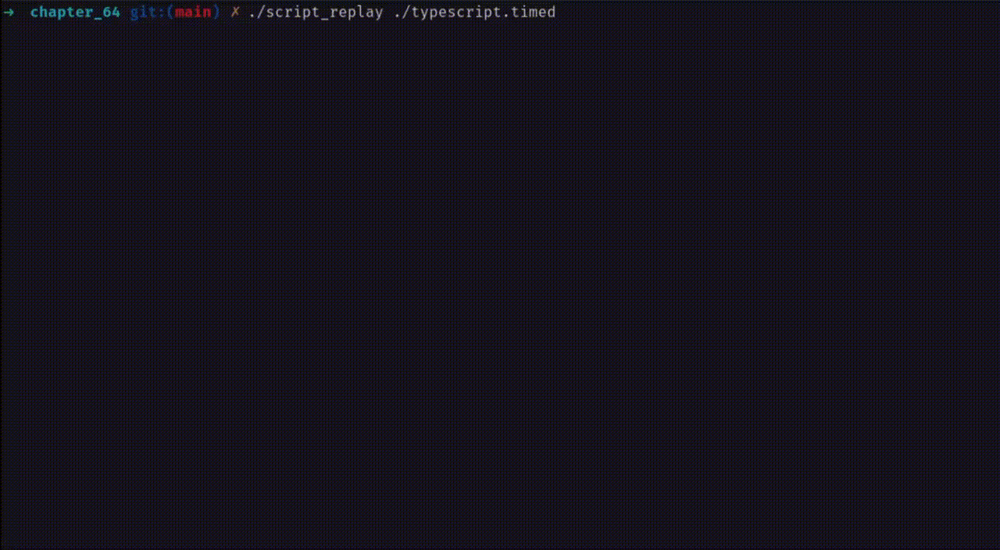

# Code

## script_ts.c
```diff
--- ./script.c	2025-10-18 12:40:28.572296237 +0300
+++ ./script_ts.c	2025-10-19 00:53:54.635974803 +0300
@@ -18,6 +18,7 @@
 #include <fcntl.h>
 #include <libgen.h>
 #include <termios.h>
+#include <time.h>
 #if ! defined(__hpux)
 /* HP-UX 11 doesn't have this header file */
 #include <sys/select.h>
@@ -28,6 +29,7 @@
 
 #define BUF_SIZE 256
 #define MAX_SNAME 1000
+#define TIMED_BUF_SIZE 1024
 
 struct termios ttyOrig;
 
@@ -43,10 +45,15 @@
 {
     char slaveName[MAX_SNAME];
     char *shell;
-    int masterFd, scriptFd;
+    char timedFilename[MAX_SNAME];
+    int masterFd, scriptFd, timedFd;
     struct winsize ws;
+    struct timespec startTime, currentTime;
     fd_set inFds;
     char buf[BUF_SIZE];
+    char timedBuf[TIMED_BUF_SIZE];
+    char lineBuf[BUF_SIZE];
+    int lineBufLen = 0;
     ssize_t numRead;
     pid_t childPid;
 
@@ -87,6 +94,17 @@
     if (scriptFd == -1)
         errExit("open typescript");
 
+    snprintf(timedFilename, MAX_SNAME, "%s.timed", (argc > 1) ? argv[1] : "typescript");
+    timedFd = open(timedFilename, O_WRONLY | O_CREAT | O_TRUNC,
+                        S_IRUSR | S_IWUSR | S_IRGRP | S_IWGRP |
+                                S_IROTH | S_IWOTH);
+    if (timedFd == -1)
+        errExit("open typescript.timed");
+
+    // record session start time
+    if (clock_gettime(CLOCK_MONOTONIC, &startTime) == -1)
+        errExit("clock_gettime");
+
     /* Place terminal in raw mode so that we can pass all terminal
      input to the pseudoterminal master untouched */
 
@@ -126,6 +144,44 @@
                 fatal("partial/failed write (STDOUT_FILENO)");
             if (write(scriptFd, buf, numRead) != numRead)
                 fatal("partial/failed write (scriptFd)");
+
+            // accumulate into line buffer and write timestamped lines
+            for (ssize_t i = 0; i < numRead; i++) {
+                lineBuf[lineBufLen++] = buf[i];
+
+                // write line when we hit newline or buffer is full
+                if (buf[i] == '\n' || lineBufLen >= BUF_SIZE - 1) {
+                    if (clock_gettime(CLOCK_MONOTONIC, &currentTime) == -1)
+                        errExit("clock_gettime");
+
+                    long long elapsedMs = (currentTime.tv_sec - startTime.tv_sec) * 1000LL +
+                                          (currentTime.tv_nsec - startTime.tv_nsec) / 1000000;
+
+                    int timedLen = snprintf(timedBuf, TIMED_BUF_SIZE, "%lld ", elapsedMs);
+
+                    // escape newlines, carriage returns, and backslashes
+                    for (int j = 0; j < lineBufLen && timedLen < TIMED_BUF_SIZE - 2; j++) {
+                        if (lineBuf[j] == '\n') {
+                            timedBuf[timedLen++] = '\\';
+                            timedBuf[timedLen++] = 'n';
+                        } else if (lineBuf[j] == '\r') {
+                            timedBuf[timedLen++] = '\\';
+                            timedBuf[timedLen++] = 'r';
+                        } else if (lineBuf[j] == '\\') {
+                            timedBuf[timedLen++] = '\\';
+                            timedBuf[timedLen++] = '\\';
+                        } else {
+                            timedBuf[timedLen++] = lineBuf[j];
+                        }
+                    }
+                    timedBuf[timedLen++] = '\n';
+
+                    if (write(timedFd, timedBuf, timedLen) != timedLen)
+                        fatal("partial/failed write (timedFd)");
+
+                    lineBufLen = 0;  // reset line buffer
+                }
+            }
         }
     }
 }
```

## script_replay.c
```C
#include <sys/stat.h>
#include <fcntl.h>
#include "tlpi_hdr.h"

#define BUF_SIZE 2048

int
main(int argc, char *argv[])
{
    FILE *fp;
    char line[BUF_SIZE];
    char unescaped[BUF_SIZE];
    long long timestamp, prevTimestamp = 0;
    char *content;
    int unescapedLen;

    // open timed file
    const char *filename = (argc > 1) ? argv[1] : "typescript.timed";
    fp = fopen(filename, "r");
    if (fp == NULL)
        errExit("fopen");

    // read and replay each line
    while (fgets(line, BUF_SIZE, fp) != NULL) {
        // parse timestamp (everything before first space)
        timestamp = strtoll(line, &content, 10);
        if (*content != ' ')
            fatal("invalid format: expected space after timestamp");
        content++;  // skip the space

        // calculate delay since last output
        long long delayMs = timestamp - prevTimestamp;
        if (delayMs > 0)
            usleep(delayMs * 1000);  // convert ms to microseconds

        // unescape content and write to stdout
        unescapedLen = 0;
        for (char *p = content; *p != '\0' && *p != '\n'; p++) {
            if (*p == '\\' && *(p + 1) != '\0') {
                p++;  // skip backslash, look at next char
                if (*p == 'n')
                    unescaped[unescapedLen++] = '\n';
                else if (*p == 'r')
                    unescaped[unescapedLen++] = '\r';
                else if (*p == '\\')
                    unescaped[unescapedLen++] = '\\';
                else {
                    // unknown escape sequence, write both chars
                    unescaped[unescapedLen++] = '\\';
                    unescaped[unescapedLen++] = *p;
                }
            } else {
                unescaped[unescapedLen++] = *p;
            }
        }

        if (write(STDOUT_FILENO, unescaped, unescapedLen) != unescapedLen)
            fatal("partial/failed write");

        prevTimestamp = timestamp;
    }

    fclose(fp);
    exit(EXIT_SUCCESS);
}

```

# Testing
```
$ ./script_ts
$ ls -l
total 564
-rw-rw-r-- 1 tomersela tomersela   698 Oct 18 12:38 01.md
-rw-rw-r-- 1 tomersela tomersela  8532 Oct 18 23:20 02.md
-rw-rw-r-- 1 tomersela tomersela  7319 Oct 19 00:27 03.md
-rw-r--r-- 1 tomersela tomersela   464 Oct 19 00:39 Makefile
-rw-r--r-- 1 tomersela tomersela  4387 Oct 18 12:40 pty_fork.c
-rw-r--r-- 1 tomersela tomersela  1021 Oct 18 12:40 pty_fork.h
-rw-rw-r-- 1 tomersela tomersela  9072 Oct 19 00:24 pty_fork.o
-rw-r--r-- 1 tomersela tomersela  2873 Oct 18 12:46 pty_master_open.c
-rw-r--r-- 1 tomersela tomersela   933 Oct 18 12:46 pty_master_open.h
-rw-rw-r-- 1 tomersela tomersela  5736 Oct 19 00:24 pty_master_open.o
-rwxrwxr-x 1 tomersela tomersela 85352 Oct 19 00:24 script
-rw-r--r-- 1 tomersela tomersela  4388 Oct 18 12:40 script.c
-rwxrwxr-x 1 tomersela tomersela 85288 Oct 19 00:25 script_mod_3
-rw-r--r-- 1 tomersela tomersela  5457 Oct 19 00:25 script_mod_3.c
-rwxrwxr-x 1 tomersela tomersela 86520 Oct 19 00:24 script_mod_a
-rw-r--r-- 1 tomersela tomersela  5123 Oct 18 13:32 script_mod_a.c
-rwxrwxr-x 1 tomersela tomersela 88984 Oct 19 00:24 script_mod_b
-rw-r--r-- 1 tomersela tomersela  6662 Oct 18 13:56 script_mod_b.c
-rwxrwxr-x 1 tomersela tomersela 86256 Oct 19 00:53 script_ts
-rw-r--r-- 1 tomersela tomersela  6879 Oct 19 00:53 script_ts.c
-rw-r--r-- 1 tomersela tomersela  3141 Oct 18 12:42 tty_functions.c
-rw-r--r-- 1 tomersela tomersela   967 Oct 18 12:42 tty_functions.h
-rw-rw-r-- 1 tomersela tomersela  5472 Oct 19 00:24 tty_functions.o
-rw-rw-r-- 1 tomersela tomersela     9 Oct 19 00:54 typescript
-rw-rw-r-- 1 tomersela tomersela    17 Oct 19 00:54 typescript.timed
$ date
Sun 19 Oct 2025 00:54:07 IDT
$ exit
$ cat typescript.timed            
2391 $ ls -l\r\n
2450 total 564\r\n
2453 -rw-rw-r-- 1 tomersela tomersela   698 Oct 18 12:38 01.md\r\n
2454 -rw-rw-r-- 1 tomersela tomersela  8532 Oct 18 23:20 02.md\r\n
2455 -rw-rw-r-- 1 tomersela tomersela  7319 Oct 19 00:27 03.md\r\n
2455 -rw-r--r-- 1 tomersela tomersela   464 Oct 19 00:39 Makefile\r\n
2456 -rw-r--r-- 1 tomersela tomersela  4387 Oct 18 12:40 pty_fork.c\r\n
2456 -rw-r--r-- 1 tomersela tomersela  1021 Oct 18 12:40 pty_fork.h\r\n
2457 -rw-rw-r-- 1 tomersela tomersela  9072 Oct 19 00:24 pty_fork.o\r\n
2457 -rw-r--r-- 1 tomersela tomersela  2873 Oct 18 12:46 pty_master_open.c\r\n
2458 -rw-r--r-- 1 tomersela tomersela   933 Oct 18 12:46 pty_master_open.h\r\n
2458 -rw-rw-r-- 1 tomersela tomersela  5736 Oct 19 00:24 pty_master_open.o\r\n
2458 -rwxrwxr-x 1 tomersela tomersela 85352 Oct 19 00:24 script\r\n
2459 -rw-r--r-- 1 tomersela tomersela  4388 Oct 18 12:40 script.c\r\n
2459 -rwxrwxr-x 1 tomersela tomersela 85288 Oct 19 00:25 script_mod_3\r\n
2460 -rw-r--r-- 1 tomersela tomersela  5457 Oct 19 00:25 script_mod_3.c\r\n
2460 -rwxrwxr-x 1 tomersela tomersela 86520 Oct 19 00:24 script_mod_a\r\n
2460 -rw-r--r-- 1 tomersela tomersela  5123 Oct 18 13:32 script_mod_a.c\r\n
2461 -rwxrwxr-x 1 tomersela tomersela 88984 Oct 19 00:24 script_mod_b\r\n
2461 -rw-r--r-- 1 tomersela tomersela  6662 Oct 18 13:56 script_mod_b.c\r\n
2461 -rwxrwxr-x 1 tomersela tomersela 86256 Oct 19 00:53 script_ts\r\n
2462 -rw-r--r-- 1 tomersela tomersela  6879 Oct 19 00:53 script_ts.c\r\n
2462 -rw-r--r-- 1 tomersela tomersela  3141 Oct 18 12:42 tty_functions.c\r\n
2463 -rw-r--r-- 1 tomersela tomersela   967 Oct 18 12:42 tty_functions.h\r\n
2463 -rw-rw-r-- 1 tomersela tomersela  5472 Oct 19 00:24 tty_functions.o\r\n
2463 -rw-rw-r-- 1 tomersela tomersela     9 Oct 19 00:54 typescript\r\n
2464 -rw-rw-r-- 1 tomersela tomersela    17 Oct 19 00:54 typescript.timed\r\n
4800 $ date\r\n
4803 Sun 19 Oct 2025 00:54:07 IDT\r\n
6982 $ exit\r\n
$ 
```

## Replay
