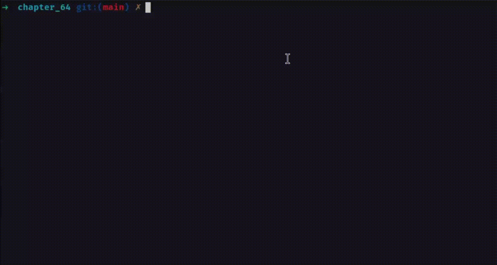

# unbuffer.c
```C
#define _XOPEN_SOURCE 600
#include <sys/select.h>

#include "pty_fork.h"           /* Declaration of ptyFork() */
#include "tlpi_hdr.h"

#define BUF_SIZE 256
#define MAX_SNAME 1000

int
main(int argc, char* argv[])
{
    int childPid;
    int masterFd;
    int numRead;
    fd_set inFds;
    char buf[BUF_SIZE];

    if (argc < 2)
        usageErr("%s command [args...]\n", argv[0]);

    childPid = ptyFork(&masterFd, NULL, MAX_SNAME, NULL, NULL);
    if (childPid == -1)
        errExit("ptyFork");
    
    if (childPid == 0) {        /* Child: execute a shell on pty slave */

        execvp(argv[1], &argv[1]);
        errExit("execvp");      /* If we get here, something went wrong */
    }


    for (;;) {
        FD_ZERO(&inFds);
        FD_SET(STDIN_FILENO, &inFds);
        FD_SET(masterFd, &inFds);
        int maxFd = (STDIN_FILENO > masterFd) ? STDIN_FILENO : masterFd;

        if (select(maxFd + 1, &inFds, NULL, NULL, NULL) == -1)
            errExit("select");

        
        if (FD_ISSET(STDIN_FILENO, &inFds)) {   /* stdin --> pty */
            numRead = read(STDIN_FILENO, buf, BUF_SIZE);
            if (numRead <= 0) // EOF or error
                exit(EXIT_SUCCESS);

            if (write(masterFd, buf, numRead) != numRead)
                fatal("partial/failed write (masterFd)");
        }


        if (FD_ISSET(masterFd, &inFds)) {      /* pty --> stdout */
            numRead = read(masterFd, buf, BUF_SIZE);
            if (numRead <= 0) // EOF or error
                exit(EXIT_SUCCESS);

            if (write(STDOUT_FILENO, buf, numRead) != numRead)
                fatal("partial/failed write (STDOUT_FILENO)");
        }
    }
}

```


# Testing
## slowprint.c
For testing, I've created a program that slowly outputs text to the screen:

```C
#include <unistd.h>
#include "tlpi_hdr.h"

int
main(int argc, char *argv[])
{
    const char *lines[] = {
        "Once upon a time, in a land of buffers and streams,",
        "there lived a program that wanted to share its dreams.",
        "But every time it spoke through a pipe so narrow,",
        "its words got stuck like a jammed arrow.",
        "Until one day, a pty came to save,",
        "and freed the words to flow like a wave.",
        "Now line by line, the story can be told,",
        "thanks to unbuffer, brave and bold!",
        NULL
    };
    
    int delay_ms = 300;

    for (int i = 0; lines[i] != NULL; i++) {
        printf("%s\n", lines[i]);
        usleep(delay_ms * 1000);
    }

    return 0;
}

```

## Running
